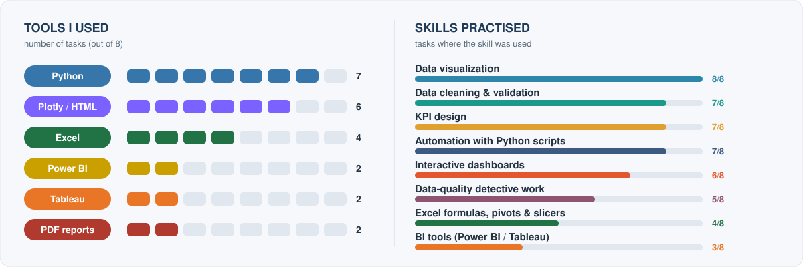
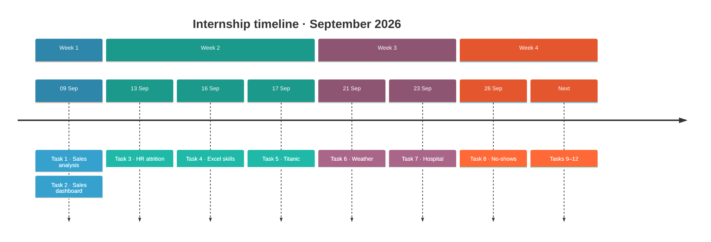
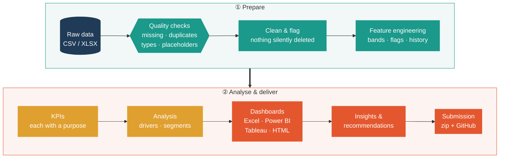

<a id="top"></a>
<p align="center">
  
</p>

<p align="center">
  
  
  <br>
  
  
</p>

<p align="center">
  This repository holds my work for the one-month <b>Data Analyst internship at VOLTIX</b>: 12 tasks, each due 3 days after it is released.<br>
  Every task starts from a raw dataset. I clean it, check it, and turn it into <b>KPIs</b>, an <b>interactive dashboard</b>, and <b>insights</b> a decision-maker can act on.
</p>

<p align="center">
  <a href="#-at-a-glance">At a glance</a> ·
  <a href="#-tools--skills">Tools &amp; skills</a> ·
  <a href="#-how-every-task-is-approached">Workflow</a> ·
  <a href="#-the-tasks">The tasks</a> ·
  <a href="#-repository-layout">Layout</a>
</p>

<br>


<br>

## 📋 At a glance

| | Task | Dataset | Main deliverable | Key finding |
|:-:|---|---|---|---|
|  | [**Basic Sales Analysis**](#task-1) | Superstore · 9,994 orders | Report (HTML/PDF) and charts | Technology leads with 36% of $2.30M sales |
|  | [**Sales Performance**](#task-2) | FactSale · 26,397 lines | Dashboard and data-quality PDF | One SKU loses money on every sale |
|  | [**HR Attrition**](#task-3) | IBM HR · 1,470 employees | HTML dashboard and Power BI | Overtime workers leave at about 3× the rate |
|  | [**Excel Skills**](#task-4) | 7 exercises | Formatted workbook | Formatting, formulas, reports, charts |
|  | [**Titanic Survival**](#task-5) | 418 passengers | Plotly dashboard | `Survived` = `Sex` in all 418 rows (a benchmark file) |
|  | [**Weather Patterns**](#task-6) | 3,271 days | HTML and Tableau | 3.7% of days bring half of all rain |
|  | [**Hospital Analytics**](#task-7) | 247 admissions | HTML, Tableau and Power BI | 79% of bills are placeholders |
|  | [**Healthcare No-Shows**](#task-8) | 106,987 appointments | Excel dashboard (Pivots and Slicers) | SMS helps, but raw numbers hide it (Simpson's paradox) |
|  | *coming soon* | | | |
|  | *coming soon* | | | |
|  | *coming soon* | | | |
|  | *coming soon* | | | |

<br>

## 🧰 Tools & skills



<br>

## 🗓️ Timeline



<br>

## 🔁 How every task is approached



| 🧾 Every decision is logged | 🚩 Flag, don't delete | 🎯 KPIs with a purpose | ⚙️ Reproducible |
|---|---|---|---|
| Each cleaning step is recorded with its evidence in a data-quality report or Cleaning Log sheet | Suspicious rows are flagged and kept, unless they are impossible | Every KPI says why it matters, and every insight has numbers behind it | Scripts rebuild everything from the raw file |

<br>

## 📂 The tasks

<a id="task-1"></a>


<table>
<tr>
<td width="46%"><a href="Task%201"></a></td>
<td>

**What I did**
- Cleaned the Superstore data: fixed text dates, handled missing postal codes, validated the numbers
- Answered 6 business questions and made 5 charts
- Delivered an HTML/PDF report and an Excel summary

**💡 Key finding:** $2.30M in sales at a 12.5% margin. **Technology** brings 36% of sales, **West** is the top region, and **November** is the peak month.

📎 [Report](Task%201/Sales_Analysis_Report.md) · [Charts](Task%201/charts)
</td>
</tr>
</table>

<p align="right"><a href="#top">↑ back to top</a></p>

<a id="task-2"></a>


<table>
<tr>
<td width="46%"><a href="Task%202"></a></td>
<td>

**What I did**
- Validated 26,397 invoice lines and imputed 13 missing delivery dates, based on a rule that holds in 100% of the other rows
- Built a product-category field from free text, because no lookup tables were provided
- Delivered an interactive dashboard and a one-page data-quality PDF

**💡 Key finding:** the margin is 49.9%, but **every sale of one Halloween mask SKU loses money**. That points to a costing error, not noise.

📎 [Insights](Task%202/KEY_INSIGHTS.md) · [Data quality](Task%202/DATA_QUALITY_REPORT.md)
</td>
</tr>
</table>

<p align="right"><a href="#top">↑ back to top</a></p>

<a id="task-3"></a>


<table>
<tr>
<td width="46%"><a href="Task%203"></a></td>
<td>

**What I did**
- Analysed attrition by department, role, pay, satisfaction and overtime
- Delivered an HTML dashboard and a **Power BI** model (`.pbix`) with a build guide

**💡 Key finding:** 16.1% attrition overall. **Overtime workers leave at about 3×** the rate of others, and Sales Representatives at 40%.

📎 [Insights](Task%203/KEY_INSIGHTS.md) · [Power BI guide](Task%203/Power_BI_Guide.md)
</td>
</tr>
</table>

<p align="right"><a href="#top">↑ back to top</a></p>

<a id="task-4"></a>


<table>
<tr>
<td width="46%"><a href="Task%204"></a></td>
<td>

**What I did** (7 exercises)
- Professional date and currency formatting
- Highlighting the highest and lowest values
- Conditional formatting against a reference cell
- Formula-driven cells and a price lookup with order totals
- A sales-person report with a chart
- A new invoice

📎 [Workbook](Task%204)
</td>
</tr>
</table>

<p align="right"><a href="#top">↑ back to top</a></p>

<a id="task-5"></a>


<table>
<tr>
<td width="46%"><a href="Task%205"></a></td>
<td>

**What I did**
- Cleaned 418 passengers and engineered family size, travelling-alone and cabin fields
- Built an interactive Plotly dashboard

**💡 Key finding:** a data-quality catch. `Survived` matches `Sex` in **all 418 rows**, which is the signature of Kaggle's benchmark file. Survival-by-sex is therefore labelled as tautological, not presented as a discovery.

📎 [Insights](Task%205/KEY_INSIGHTS.md) · [Data quality](Task%205/DATA_QUALITY_REPORT.md)
</td>
</tr>
</table>

<p align="right"><a href="#top">↑ back to top</a></p>

<a id="task-6"></a>


<table>
<tr>
<td width="46%"><a href="Task%206"></a></td>
<td>

**What I did**
- Found and blanked 2 blocks of **placeholder values** (wind gusts and cloud cover). Left in, they would have made westerly winds look twice as common as they are
- Delivered an HTML dashboard, a **Tableau** workbook with 4 dashboards, and a Power BI guide

**💡 Key finding:** heavy-rain days are 3.7% of all days but carry **49.5% of all rainfall**.

📎 [README](Task%206/README.md) · [Insights](Task%206/KEY_INSIGHTS.md)
</td>
</tr>
</table>

<p align="right"><a href="#top">↑ back to top</a></p>

<a id="task-7"></a>


<table>
<tr>
<td width="46%"><a href="Task%207"></a></td>
<td>

**What I did**
- Cleaned an Arabic-language admissions file: fixed 29 reversed dates and found that **79% of bills are placeholders**
- Built the same dashboard 3 times: **HTML**, **Tableau** and **Power BI** (22 DAX measures)

**💡 Key finding:** recorded severity **does not predict** length of stay (p = 0.91). Stays of 15+ days are 11% of admissions but 35% of bed-days.

📎 [README](Task%207/README.md) · [Insights](Task%207/KEY_INSIGHTS.md)
</td>
</tr>
</table>

<p align="right"><a href="#top">↑ back to top</a></p>

<a id="task-8"></a>


<table>
<tr>
<td width="46%"><a href="Task%208"></a></td>
<td>

**What I did**
- Cleaned 106,987 appointments: removed 5 impossible rows, flagged corrupted IDs and ages of 115, and derived each patient's no-show history
- Built an Excel dashboard with 10 **Pivot Tables**, 9 **Pivot Charts**, 9 **Slicers** and a **Timeline**, plus 23 formula KPIs

**💡 Key finding:** SMS seems to *raise* no-shows (27.7% vs 16.7%), because it is only sent for advance bookings. Compared at the same lead time, it **lowers** them by 1.6–7.8 points.

📎 [README](Task%208/README.md) · [Insights](Task%208/KEY_INSIGHTS.md)
</td>
</tr>
</table>

<p align="right"><a href="#top">↑ back to top</a></p>

<p align="center"><b>Tasks 9–12:</b> <i>coming soon. Each will be added here once it is released.</i></p>

<br>

## 🗂️ Repository layout

```
Task N/
├── <raw dataset>              # input, never modified
├── Cleaned_*.csv              # cleaned + engineered data
├── clean_*.py / analysis.py   # pipeline scripts, in run order
├── build_*.py                 # dashboard / workbook generators
├── *Dashboard*                # .html / .xlsb / .pbix / .twbx
├── DATA_QUALITY_REPORT.md     # what was checked and why
├── KEY_INSIGHTS.md            # findings + recommendations
├── screenshots/               # dashboard previews
└── NahlaNabil.zip             # the submitted package
assets/                        # README graphics (python assets/make_assets.py)
```

<p align="center"><sub>Nahla Nabil · VOLTIX Data Analyst Internship · 2026</sub></p>
