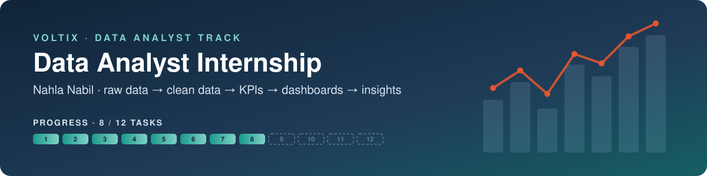
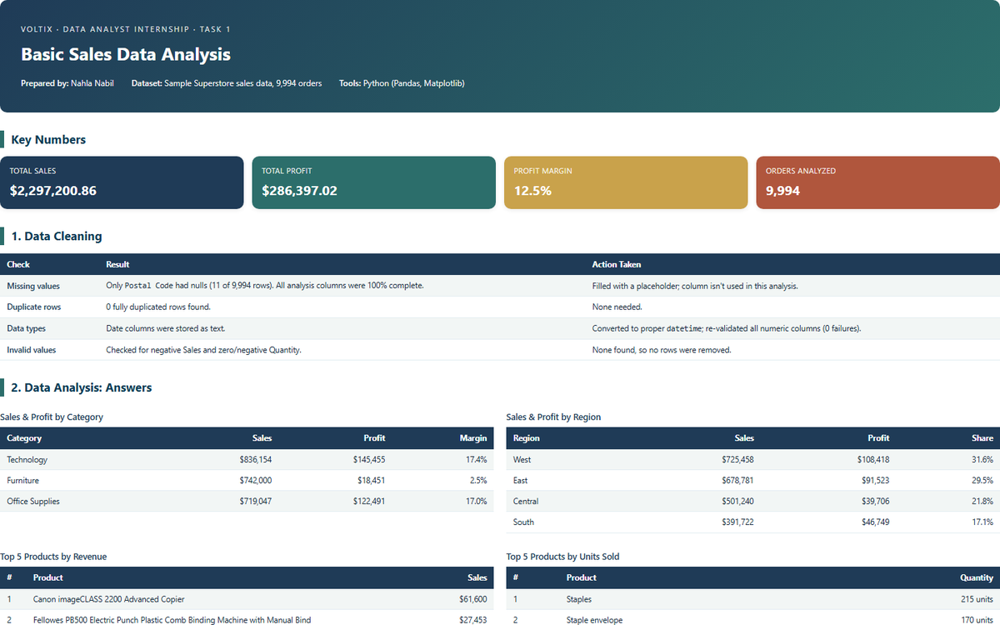
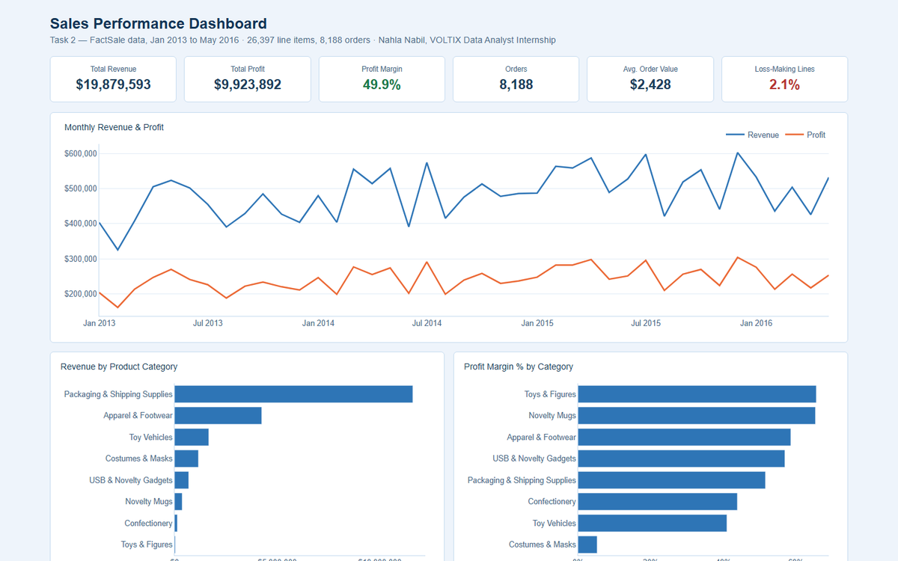
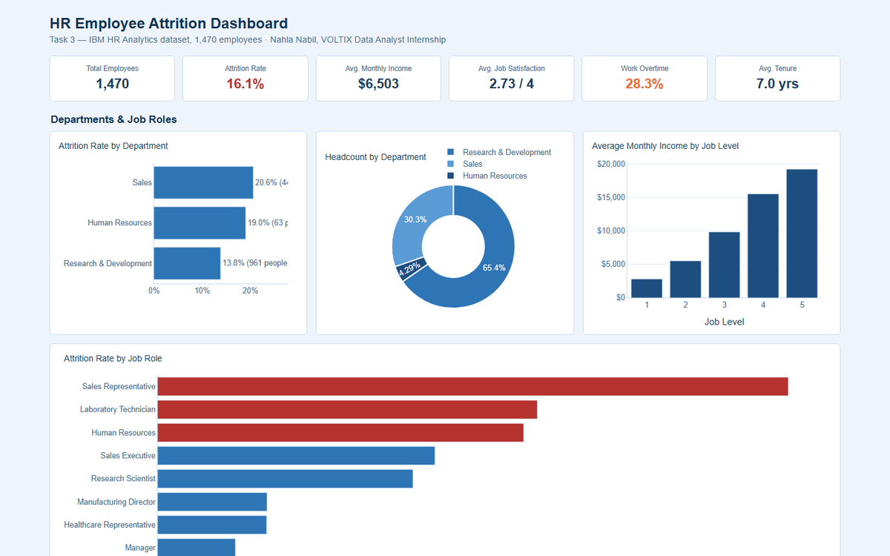
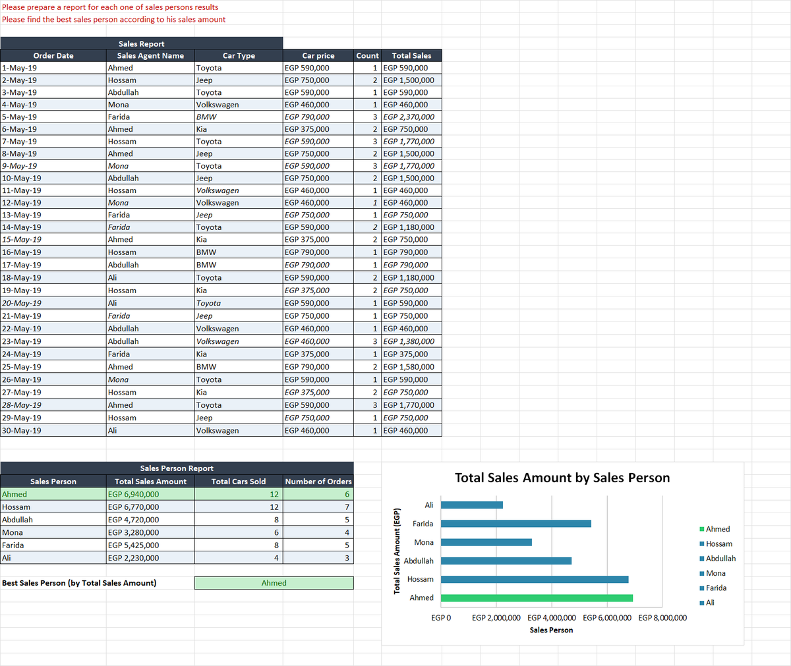
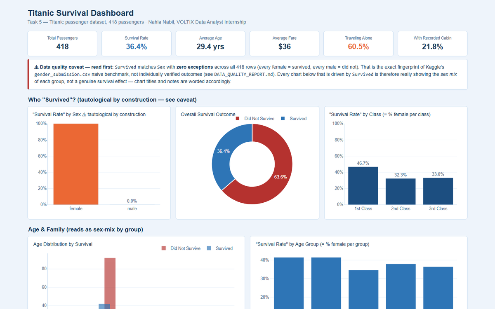
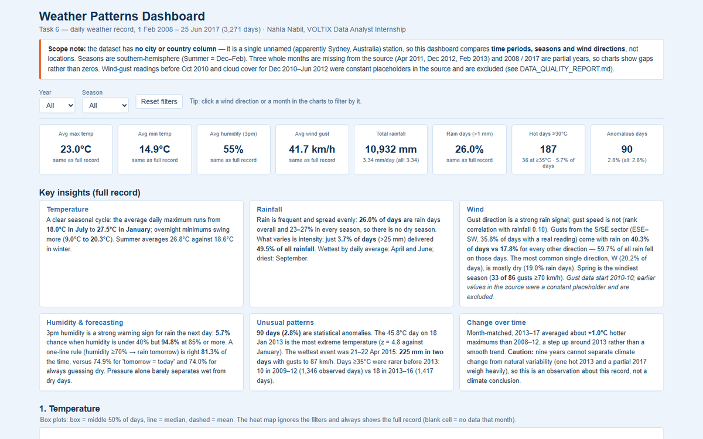
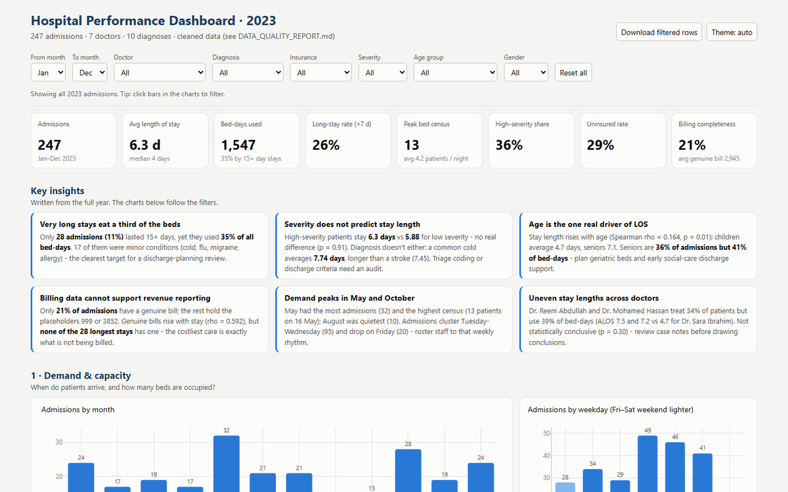
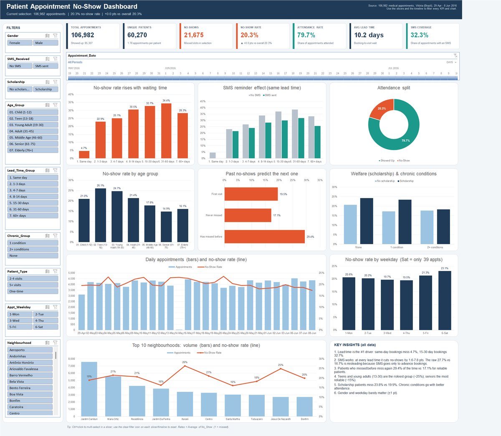

<p align="center">
  
</p>

<p align="center">
  
  
  
  
  
</p>

This repository holds my work for the one-month **Data Analyst internship at VOLTIX**. The internship has 12 tasks, and each one is due 3 days after it is released.
Every task starts from a raw dataset. I clean it, check it, and turn it into KPIs, an interactive dashboard, and insights a decision-maker can act on.
Each folder is self-contained, with the raw data, the cleaned data, the scripts that produced it, the dashboard, and the written findings.

---

## At a glance

| # | Task | Dataset | Built with | Main deliverable | Key finding |
|:-:|---|---|---|---|---|
| 1 | [Basic Sales Analysis](Task%201) | Superstore, 9,994 orders | Python, Excel | Report (HTML/PDF) and charts | Technology leads with 36% of $2.30M sales. November is the peak month. |
| 2 | [Sales Performance](Task%202) | FactSale, 26,397 line items | Python, HTML | Interactive dashboard and data-quality PDF | Every sale of one SKU loses money, which points to a pricing error, not noise. |
| 3 | [HR Attrition](Task%203) | IBM HR, 1,470 employees | Python, Power BI | HTML dashboard and `.pbix` | Employees who work overtime leave at about **3×** the rate. Sales Reps churn at 40%. |
| 4 | [Excel Skills](Task%204) | 7 practical exercises | Excel | Formatted workbook | Formatting, conditional formatting, formulas, reports, charts, invoice |
| 5 | [Titanic Survival](Task%205) | 418 passengers | Python, Plotly | Interactive dashboard | Found that `Survived` = `Sex` in every row: the file is a benchmark, not real outcomes. |
| 6 | [Weather Patterns](Task%206) | 3,271 daily records | Python, Plotly, Tableau | HTML dashboard and `.twbx` | Found 2 blocks of placeholder data. 3.7% of days bring half of all rain. |
| 7 | [Hospital Analytics](Task%207) | 247 admissions (Arabic source) | Python, Excel, Tableau, Power BI | 3 dashboards (HTML, `.twbx`, `.pbix`) | 79% of bills are placeholders. Recorded severity does not predict length of stay. |
| 8 | [Healthcare No-Shows](Task%208) | 106,987 appointments | Excel (Pivots, Slicers), Python | Interactive Excel dashboard | SMS looks harmful overall but helps at every lead time (Simpson's paradox). |
| 9 | *coming soon* | | | | |
| 10 | *coming soon* | | | | |
| 11 | *coming soon* | | | | |
| 12 | *coming soon* | | | | |

---

## How every task is approached

```mermaid
flowchart LR
    A[("Raw data<br/>CSV / XLSX")] --> B{"Data quality<br/>checks"}
    B -->|missing · duplicates<br/>types · impossible values<br/>placeholders| C["Clean & flag<br/>(nothing silently deleted)"]
    C --> D["Feature engineering<br/>bands · flags · history"]
    D --> E["KPIs<br/>each with a purpose"]
    E --> F["Analysis<br/>drivers · segments · tests"]
    F --> G["Dashboards<br/>Excel · Power BI · Tableau · HTML"]
    G --> H["Insights &<br/>recommendations"]
    H --> I[["Submission<br/>zip + GitHub"]]

    classDef data fill:#1F3B57,stroke:#1F3B57,color:#fff
    classDef work fill:#E8F6F3,stroke:#1B998B,color:#12313a
    classDef out fill:#E4572E,stroke:#E4572E,color:#fff
    class A data
    class B,C,D,E,F work
    class G,H,I out
```



The same principles apply in every task:
- **Every cleaning decision is logged** with the evidence behind it, in a `DATA_QUALITY_REPORT.md` or a Cleaning Log sheet.
- **Suspicious rows are flagged rather than deleted**, unless they are impossible.
- **Every KPI states why it matters.** Each insight comes with numbers you can trace back to the data.
- **Dashboards are generated by scripts**, so the whole pipeline can be re-run from the raw file.

### Tools across the tasks

| Tool | T1 | T2 | T3 | T4 | T5 | T6 | T7 | T8 |
|---|:-:|:-:|:-:|:-:|:-:|:-:|:-:|:-:|
| Python (pandas) | ● | ● | ● | | ● | ● | ● | ● |
| Excel | ● | | | ● | | | ● | ● |
| Pivot Tables / Slicers | | | | | | | | ● |
| HTML / Plotly dashboard | ● | ● | ● | | ● | ● | ● | |
| Power BI | | | ● | | | ○ | ● | |
| Tableau | | | | | | ● | ● | |
| PDF report | ● | ● | | | | | | |

● = delivered · ○ = build guide only

---

## The tasks

### Task 1: Basic Sales Data Analysis


- Cleaned the Superstore dataset: fixed text dates, handled missing postal codes, and validated the numeric columns.
- Answered 6 business questions (sales, profit, top category, product, region and month) and made 5 charts.
- Delivered the results as a styled HTML/PDF report and an Excel summary.

**Key finding:** $2.30M in sales at a 12.5% margin. **Technology** brings 36% of sales, **West** is the top region, and **November** is the best month.
→ [Report](Task%201/Sales_Analysis_Report.md) · [Charts](Task%201/charts)

### Task 2: Sales Performance Dashboard


- Validated 26,397 invoice lines and imputed 13 missing delivery dates. The rule behind the fill holds in 100% of the other rows.
- Built a product-category dimension from free text, because no lookup tables were provided.
- Delivered an interactive dashboard and a one-page data-quality PDF.

**Key finding:** the margin is a healthy 49.9%, but **every single sale of one Halloween mask SKU is at a loss**. That points to a costing error that can be fixed.
→ [Insights](Task%202/KEY_INSIGHTS.md) · [Data quality](Task%202/DATA_QUALITY_REPORT.md)

### Task 3: HR Employee Attrition


- Analysed attrition by department, role, pay, satisfaction and overtime for 1,470 employees.
- Delivered an HTML dashboard and a **Power BI** model (`.pbix`) with a build guide.

**Key finding:** 16.1% attrition overall. Overtime workers leave at about **3×** the rate of others, and **Sales Representatives** at 40%.
→ [Insights](Task%203/KEY_INSIGHTS.md) · [Power BI guide](Task%203/Power_BI_Guide.md)

### Task 4: Excel Skills


The 7 exercises cover:
- Professional date and currency formatting
- Highlighting the highest and lowest values
- Conditional formatting against a reference cell
- Formula-driven cells
- A sales-person report with a chart
- A price lookup with order totals
- A new invoice

→ [Workbook](Task%204)

### Task 5: Titanic Survival


- Cleaned 418 passengers and engineered family size, travelling alone, and cabin fields.
- Built an interactive Plotly dashboard.

**Key finding:** a data-quality catch. `Survived` matches `Sex` in all 418 rows, which is the signature of Kaggle's `gender_submission` benchmark. For that reason, survival-by-sex results are labelled as tautological rather than presented as a discovery.
→ [Insights](Task%205/KEY_INSIGHTS.md) · [Data quality](Task%205/DATA_QUALITY_REPORT.md)

### Task 6: Weather & Climate Patterns


- Found and blanked two blocks of **placeholder values**: wind gusts were fixed at 41 km/h W for 957 days, and cloud cover was constant for 520 days. Left in, they would have made westerly winds look twice as common as they are.
- Delivered an HTML dashboard, a **Tableau** workbook with 4 dashboards, and a Power BI guide.

**Key finding:** rain is concentrated in a few days. Heavy-rain days are 3.7% of all days but carry **49.5% of all rainfall**.
→ [README](Task%206/README.md) · [Insights](Task%206/KEY_INSIGHTS.md)

### Task 7: Hospital Analytics


- Cleaned an Arabic-language admissions file. The work included fixing 29 reversed admission/discharge dates and finding that **79% of bills are placeholders**.
- Built the same dashboard three times: **HTML**, **Tableau** (`.twbx`) and **Power BI** (`.pbix`, 22 DAX measures).

**Key finding:** recorded severity does not predict length of stay (p = 0.91), so severity coding needs an audit. Stays of 15+ days are 11% of admissions but 35% of bed-days.
→ [README](Task%207/README.md) · [Insights](Task%207/KEY_INSIGHTS.md)

### Task 8: Healthcare No-Shows (Excel Dashboard)


- Cleaned 106,987 appointments. I removed 5 rows booked after their own appointment date, flagged corrupted patient IDs and ages of 115, and derived each patient's no-show history.
- Built an Excel dashboard with 10 **Pivot Tables**, 9 **Pivot Charts**, 9 **Slicers** and a **Timeline**. KPI cards update through `GETPIVOTDATA`. The workbook also has 23 formula KPIs.

**Key finding:** at first glance, SMS reminders seem to *raise* no-shows (27.7% vs 16.7%). The reason is that SMS is only sent for advance bookings. Compared at the same lead time, SMS **lowers** no-shows by 1.6–7.8 points, yet half of advance bookings get no SMS.
→ [README](Task%208/README.md) · [Insights](Task%208/KEY_INSIGHTS.md)

### Tasks 9–12
*Coming soon. They will be added here as they are released.*

---

## Repository layout

```
Task N/
├── <raw dataset>              # input, never modified
├── Cleaned_*.csv              # cleaned + engineered data
├── clean_*.py / analysis.py   # pipeline scripts, in run order
├── build_*.py                 # dashboard / workbook generators
├── *Dashboard*                # .html / .xlsx / .pbix / .twbx
├── DATA_QUALITY_REPORT.md     # what was checked and why
├── KEY_INSIGHTS.md            # findings + recommendations
├── screenshots/               # dashboard previews
└── NahlaNabil.zip             # the submitted package
```

<p align="center"><sub>Nahla Nabil · VOLTIX Data Analyst Internship · 2026</sub></p>
