<a id="top"></a>
<p align="center">
   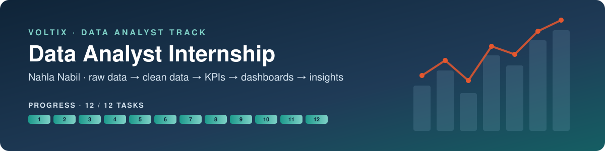
</p>

<p align="center">
  
  
  <br>
  
  
</p>

<p align="center">
  This repository holds my work for the one-month <b>Data Analyst internship at VOLTIX</b>: 12 tasks, each due 3 days after it is released.<br>
  Every task starts from a raw dataset. I clean it, check it, and turn it into <b>KPIs</b>, an <b>interactive dashboard</b>, and <b>insights</b> a decision-maker can act on.
</p>

<p align="center">
  <a href="#-at-a-glance">At a glance</a> ·
  <a href="#-tools--skills">Tools &amp; skills</a> ·
  <a href="#-how-every-task-is-approached">Workflow</a> ·
  <a href="#-the-tasks">The tasks</a> ·
  <a href="#-repository-layout">Layout</a>
</p>

<br>


<br>

## 📋 At a glance

| | Task | Dataset | Main deliverable | Key finding |
|:-:|---|---|---|---|
|  | [**Basic Sales Analysis**](#task-1) | Superstore · 9,994 orders | Report (HTML/PDF) and charts | Technology leads with 36% of $2.30M sales |
|  | [**Sales Performance**](#task-2) | FactSale · 26,397 lines | Dashboard and data-quality PDF | One SKU loses money on every sale |
|  | [**HR Attrition**](#task-3) | IBM HR · 1,470 employees | HTML dashboard and Power BI | Overtime workers leave at about 3× the rate |
|  | [**Excel Skills**](#task-4) | 7 exercises | Formatted workbook | Formatting, formulas, reports, charts |
|  | [**Titanic Survival**](#task-5) | 418 passengers | Plotly dashboard | `Survived` = `Sex` in all 418 rows (a benchmark file) |
|  | [**Weather Patterns**](#task-6) | 3,271 days | HTML and Tableau | 3.7% of days bring half of all rain |
|  | [**Hospital Analytics**](#task-7) | 247 admissions | HTML, Tableau and Power BI | 79% of bills are placeholders |
|  | [**Healthcare No-Shows**](#task-8) | 106,987 appointments | Excel dashboard (Pivots and Slicers) | SMS helps, but raw numbers hide it (Simpson's paradox) |
|  | [**Customer Data Analysis**](#task-9) | Customers · 2,150 records | HTML, Power BI and PDF summary | $750+ orders: 26% of orders, 45% of revenue |
|  | [**Movie Analytics**](#task-10) | TMDB 5000 · 4,803 movies | Power BI dashboard (7 pages) | Small films return most per dollar; $100M+ films are the safest bet |
|  | [**Video Game Industry**](#task-11) | Games · 16,717 titles | Excel dashboard (Pivots, Slicers and Timeline) | Top 1% of titles take 22% of all sales |
|  | [**NYC Airbnb — Final Project**](#task-12) | Airbnb NYC · 48,884 listings | HTML + Excel dashboards, final report | Manhattan $149 vs Bronx $65; price buys zero reviews (r = −0.06) |

<br>

## 🧰 Tools & skills

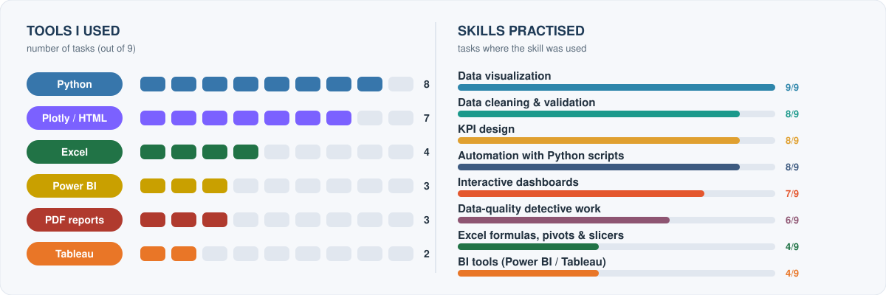

<br>

## 🗓️ Timeline

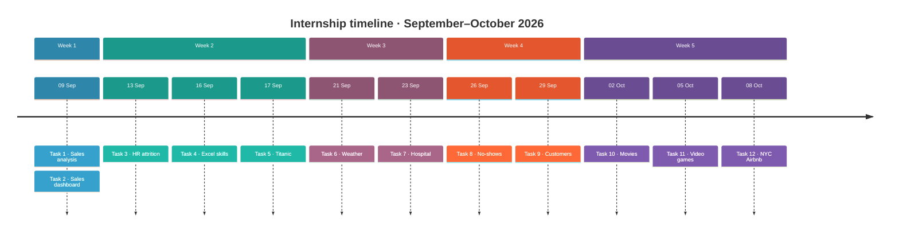
```mermaid
%%{init: {'theme':'base','themeVariables':{'cScale0':'#2E86AB','cScale1':'#1B998B','cScale2':'#8E5572','cScale3':'#E4572E','cScale4':'#6A4C93','cScaleLabel0':'#ffffff','cScaleLabel1':'#ffffff','cScaleLabel2':'#ffffff','cScaleLabel3':'#ffffff','cScaleLabel4':'#ffffff'}}}%%
timeline
    title Internship timeline · September–October 2026
    section Week 1
        09 Sep : Task 1 · Sales analysis : Task 2 · Sales dashboard
    section Week 2
        13 Sep : Task 3 · HR attrition
        16 Sep : Task 4 · Excel skills
        17 Sep : Task 5 · Titanic
    section Week 3
        21 Sep : Task 6 · Weather
        23 Sep : Task 7 · Hospital
    section Week 4
        26 Sep : Task 8 · No-shows
        29 Sep : Task 9 · Customers
    section Week 5
        02 Oct : Task 10 · Movies
        05 Oct : Task 11 · Video games
        08 Oct : Task 12 · NYC Airbnb
```

<br>

## 🔁 How every task is approached

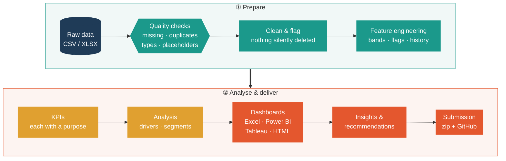
```mermaid
flowchart TB
    subgraph P1["① Prepare"]
        direction LR
        A[("Raw data<br/>CSV / XLSX")] --> B{{"Quality checks<br/>missing · duplicates<br/>types · placeholders"}}
        B --> C["Clean & flag<br/>nothing silently deleted"]
        C --> D["Feature engineering<br/>bands · flags · history"]
    end
    subgraph P2["② Analyse & deliver"]
        direction LR
        E["KPIs<br/>each with a purpose"] --> F["Analysis<br/>drivers · segments"]
        F --> G["Dashboards<br/>Excel · Power BI<br/>Tableau · HTML"]
        G --> H["Insights &<br/>recommendations"]
        H --> I[["Submission<br/>zip + GitHub"]]
    end
    P1 ==> P2

    classDef data fill:#1F3B57,stroke:#1F3B57,color:#fff
    classDef clean fill:#1B998B,stroke:#1B998B,color:#fff
    classDef kpi fill:#E0A030,stroke:#E0A030,color:#fff
    classDef out fill:#E4572E,stroke:#E4572E,color:#fff
    class A data
    class B,C,D clean
    class E,F kpi
    class G,H,I out
    style P1 fill:#F1F8F7,stroke:#1B998B,stroke-width:1px
    style P2 fill:#FDF4F1,stroke:#E4572E,stroke-width:1px
```

| 🧾 Every decision is logged | 🚩 Flag, don't delete | 🎯 KPIs with a purpose | ⚙️ Reproducible |
|---|---|---|---|
| Each cleaning step is recorded with its evidence in a data-quality report or Cleaning Log sheet | Suspicious rows are flagged and kept, unless they are impossible | Every KPI says why it matters, and every insight has numbers behind it | Scripts rebuild everything from the raw file |

<br>

## 📂 The tasks

<a id="task-1"></a>


<table>
<tr>
<td width="46%"><a href="Task%201">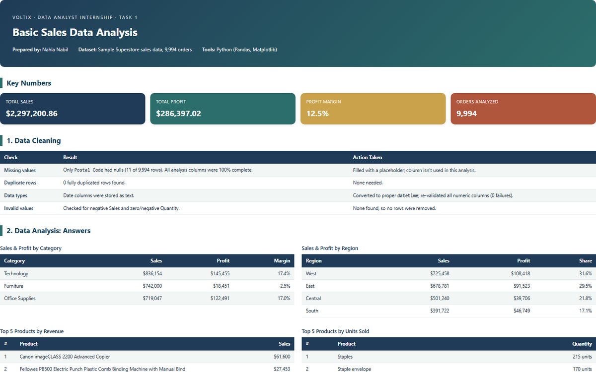</a></td>
<td>

**What I did**
- Cleaned the Superstore data: fixed text dates, handled missing postal codes, validated the numbers
- Answered 6 business questions and made 5 charts
- Delivered an HTML/PDF report and an Excel summary

**💡 Key finding:** $2.30M in sales at a 12.5% margin. **Technology** brings 36% of sales, **West** is the top region, and **November** is the peak month.

📎 [Report](Task%201/Sales_Analysis_Report.md) · [Charts](Task%201/charts)
</td>
</tr>
</table>

<p align="right"><a href="#top">↑ back to top</a></p>

<a id="task-2"></a>


<table>
<tr>
<td width="46%"><a href="Task%202">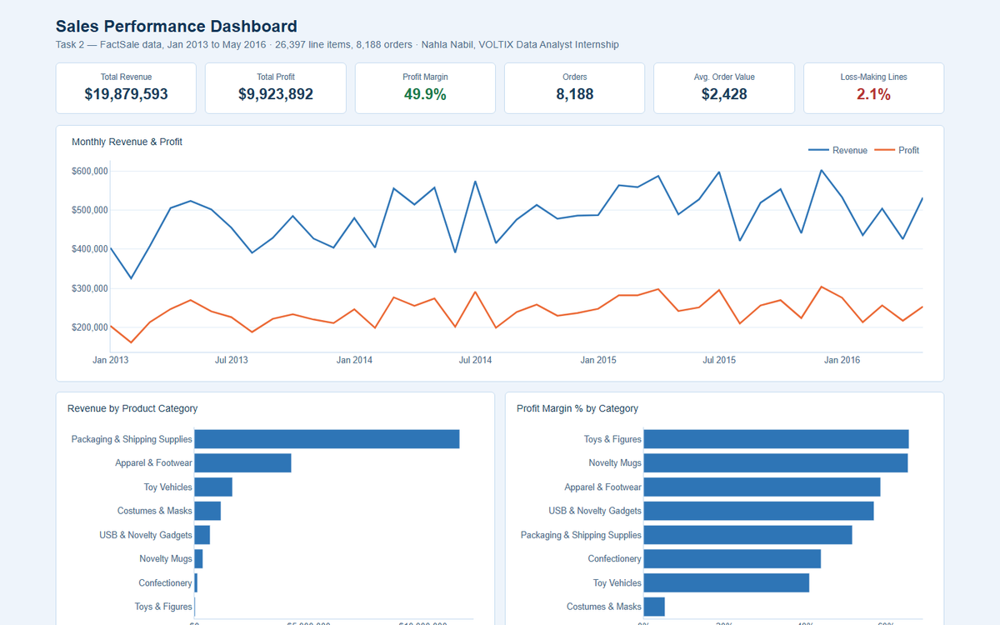</a></td>
<td>

**What I did**
- Validated 26,397 invoice lines and imputed 13 missing delivery dates, based on a rule that holds in 100% of the other rows
- Built a product-category field from free text, because no lookup tables were provided
- Delivered an interactive dashboard and a one-page data-quality PDF

**💡 Key finding:** the margin is 49.9%, but **every sale of one Halloween mask SKU loses money**. That points to a costing error, not noise.

📎 [Insights](Task%202/KEY_INSIGHTS.md) · [Data quality](Task%202/DATA_QUALITY_REPORT.md)
</td>
</tr>
</table>

<p align="right"><a href="#top">↑ back to top</a></p>

<a id="task-3"></a>


<table>
<tr>
<td width="46%"><a href="Task%203">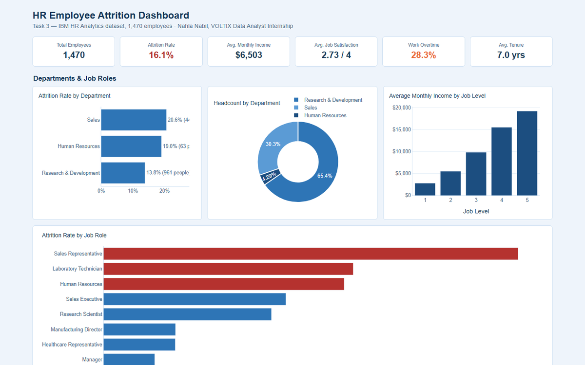</a></td>
<td>

**What I did**
- Analysed attrition by department, role, pay, satisfaction and overtime
- Delivered an HTML dashboard and a **Power BI** model (`.pbix`) with a build guide

**💡 Key finding:** 16.1% attrition overall. **Overtime workers leave at about 3×** the rate of others, and Sales Representatives at 40%.

📎 [Insights](Task%203/KEY_INSIGHTS.md) · [Power BI guide](Task%203/Power_BI_Guide.md)
</td>
</tr>
</table>

<p align="right"><a href="#top">↑ back to top</a></p>

<a id="task-4"></a>


<table>
<tr>
<td width="46%"><a href="Task%204">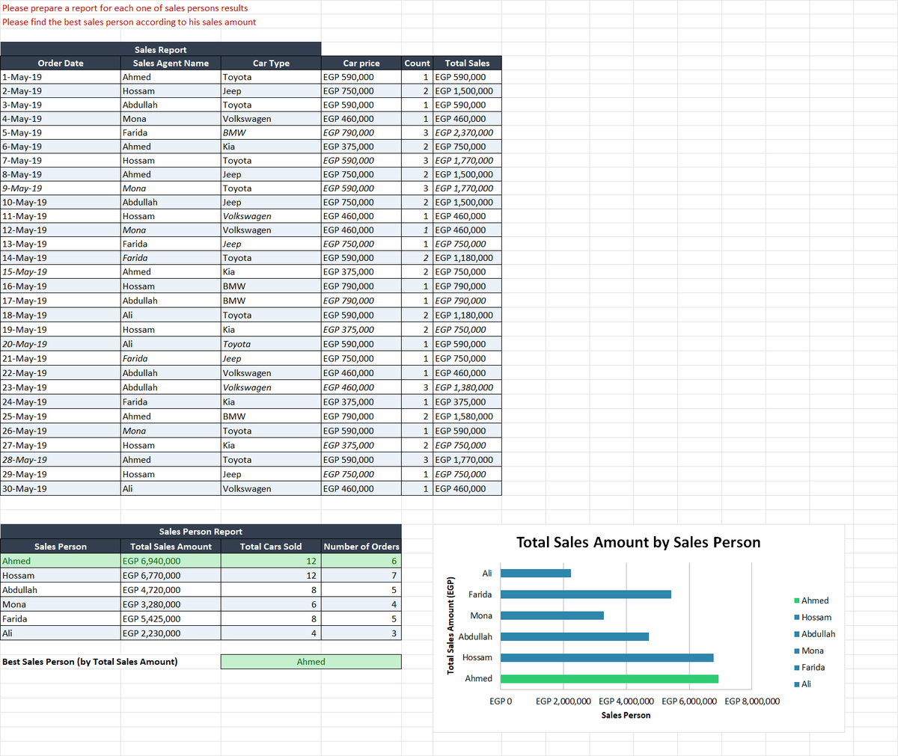</a></td>
<td>

**What I did** (7 exercises)
- Professional date and currency formatting
- Highlighting the highest and lowest values
- Conditional formatting against a reference cell
- Formula-driven cells and a price lookup with order totals
- A sales-person report with a chart
- A new invoice

📎 [Workbook](Task%204)
</td>
</tr>
</table>

<p align="right"><a href="#top">↑ back to top</a></p>

<a id="task-5"></a>


<table>
<tr>
<td width="46%"><a href="Task%205">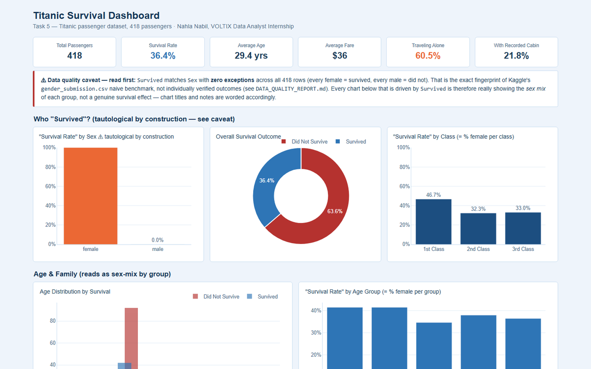</a></td>
<td>

**What I did**
- Cleaned 418 passengers and engineered family size, travelling-alone and cabin fields
- Built an interactive Plotly dashboard

**💡 Key finding:** a data-quality catch. `Survived` matches `Sex` in **all 418 rows**, which is the signature of Kaggle's benchmark file. Survival-by-sex is therefore labelled as tautological, not presented as a discovery.

📎 [Insights](Task%205/KEY_INSIGHTS.md) · [Data quality](Task%205/DATA_QUALITY_REPORT.md)
</td>
</tr>
</table>

<p align="right"><a href="#top">↑ back to top</a></p>

<a id="task-6"></a>


<table>
<tr>
<td width="46%"><a href="Task%206">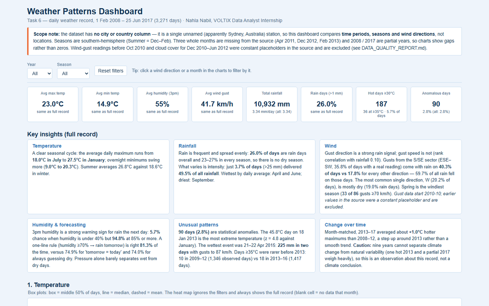</a></td>
<td>

**What I did**
- Found and blanked 2 blocks of **placeholder values** (wind gusts and cloud cover). Left in, they would have made westerly winds look twice as common as they are
- Delivered an HTML dashboard, a **Tableau** workbook with 4 dashboards, and a Power BI guide

**💡 Key finding:** heavy-rain days are 3.7% of all days but carry **49.5% of all rainfall**.

📎 [README](Task%206/README.md) · [Insights](Task%206/KEY_INSIGHTS.md)
</td>
</tr>
</table>

<p align="right"><a href="#top">↑ back to top</a></p>

<a id="task-7"></a>


<table>
<tr>
<td width="46%"><a href="Task%207">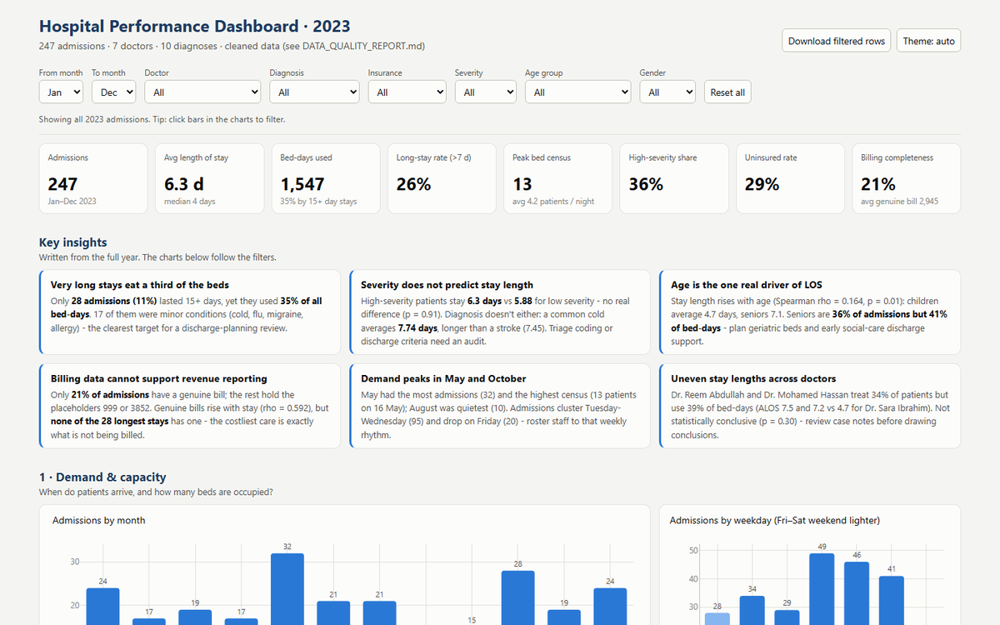</a></td>
<td>

**What I did**
- Cleaned an Arabic-language admissions file: fixed 29 reversed dates and found that **79% of bills are placeholders**
- Built the same dashboard 3 times: **HTML**, **Tableau** and **Power BI** (22 DAX measures)

**💡 Key finding:** recorded severity **does not predict** length of stay (p = 0.91). Stays of 15+ days are 11% of admissions but 35% of bed-days.

📎 [README](Task%207/README.md) · [Insights](Task%207/KEY_INSIGHTS.md)
</td>
</tr>
</table>

<p align="right"><a href="#top">↑ back to top</a></p>

<a id="task-8"></a>


<table>
<tr>
<td width="46%"><a href="Task%208">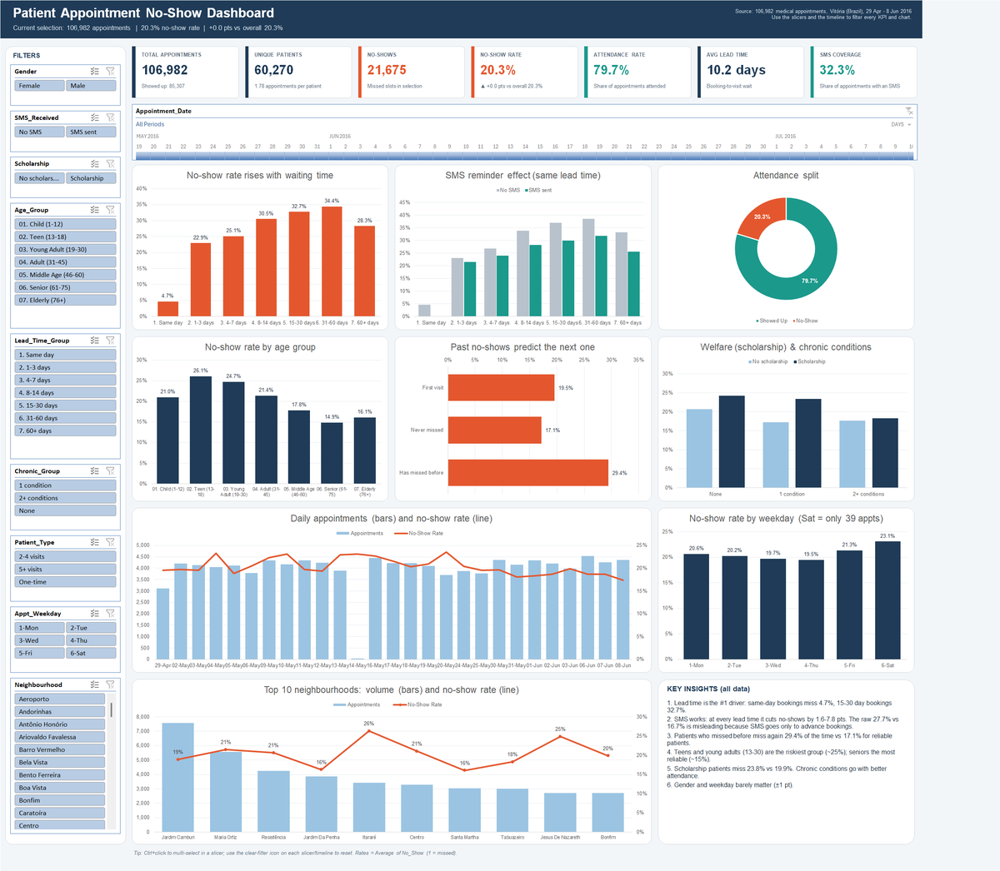</a></td>
<td>

**What I did**
- Cleaned 106,987 appointments: removed 5 impossible rows, flagged corrupted IDs and ages of 115, and derived each patient's no-show history
- Built an Excel dashboard with 10 **Pivot Tables**, 9 **Pivot Charts**, 9 **Slicers** and a **Timeline**, plus 23 formula KPIs

**💡 Key finding:** SMS seems to *raise* no-shows (27.7% vs 16.7%), because it is only sent for advance bookings. Compared at the same lead time, it **lowers** them by 1.6–7.8 points.

📎 [README](Task%208/README.md) · [Insights](Task%208/KEY_INSIGHTS.md)
</td>
</tr>
</table>

<p align="right"><a href="#top">↑ back to top</a></p>

<a id="task-9"></a>


<table>
<tr>
<td width="46%"><a href="Task%209">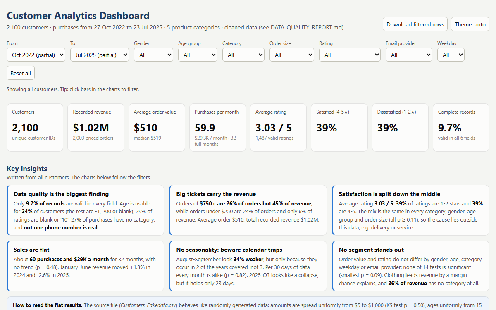</a></td>
<td>

**What I did**
- Cleaned 2,150 customer records: 50 duplicates, age placeholders (-1 / 200), ratings of 10 on a 1–5 scale and impossible dates were handled one by one. Only **9.7%** of records turned out to be complete
- Built an interactive **HTML dashboard**, a 5-page **Power BI** report (30 DAX measures, checked against Python with DAX queries) and a 5-page PDF summary

**💡 Key finding:** **$750+ orders are 26% of orders but 45% of revenue**, and customers are split 39% / 39% between dissatisfied and satisfied. The August–September "slump" is a calendar-coverage artefact, and no segment differs. The file behaves like randomly generated data.

📎 [README](Task%209/README.md) · [Insights](Task%209/KEY_INSIGHTS.md) · [Summary PDF](Task%209/Customer_Analysis_Summary.pdf) · [Power BI (.pbix)](Task%209/Customer_Dashboard.pbix)
</td>
</tr>
</table>

<p align="right"><a href="#top">↑ back to top</a></p>

<a id="task-10"></a>


<table>
<tr>
<td width="46%"><a href="Task%2010">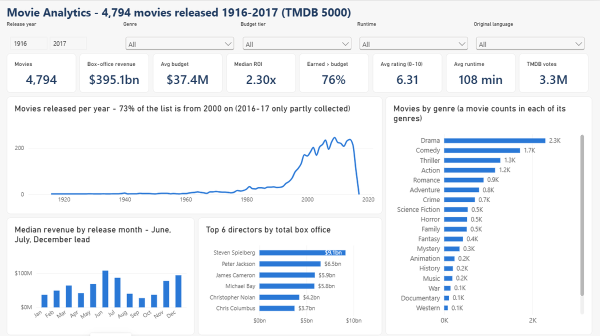</a></td>
<td>

**What I did**
- Joined the TMDB movies and credits files (4,803 movies). A budget or revenue of 0 was treated as "unknown", not zero, and ratings with under 50 votes were left out of averages
- Built a 7-page **Power BI** dashboard: 28 DAX measures, Top N filters, correlation measures, an IMDb-style **weighted rating** with a minimum-votes slicer, and 5 synced slicers

**💡 Key finding:** budget and revenue move together (r = 0.70). **$100M+ movies are the safest (91% profitable)**, but **films under $10M earn the best return (3.7×)**. Longer movies are rated higher (r = 0.40), and June, July and December releases earn the most.

📎 [README](Task%2010/README.md) · [Power BI (.pbix)](Task%2010/Movie_Dashboard.pbix)
</td>
</tr>
</table>

<p align="right"><a href="#top">↑ back to top</a></p>

<a id="task-11"></a>


<table>
<tr>
<td width="46%"><a href="Task%2011">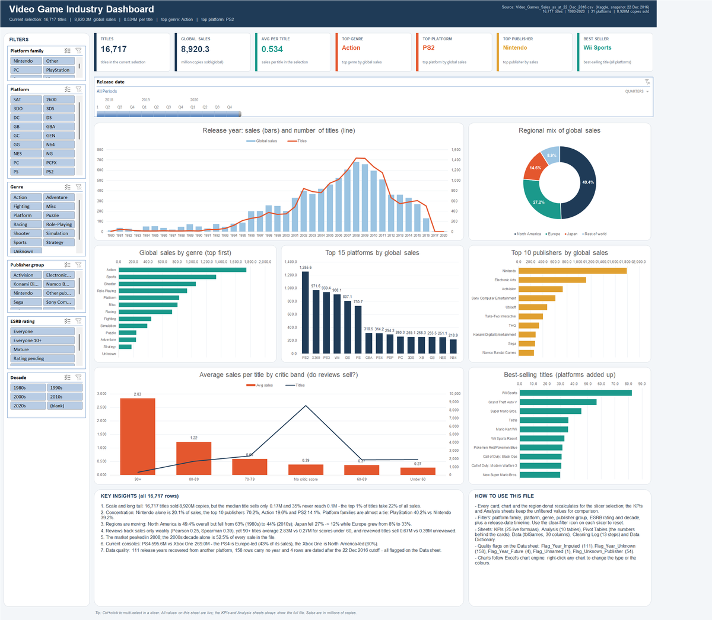</a></td>
<td>

**What I did**
- Cleaned 16,719 game records (plus PS4 and Xbox One console files): 2 duplicates removed, 111 missing years recovered from other platforms, the rest flagged, never silently dropped
- Built an Excel dashboard with 7 **Pivot Tables**, 7 **Pivot Charts**, 6 **Slicers** and a **Timeline**, plus 25 formula KPIs and 10 analysis tables

**💡 Key finding:** **16,717 titles sold 8,920.3M copies, but the top 1% take 22% of sales.** Nintendo alone is 20.1%, reviews track sales only weakly (r = 0.25), and the market peaked in 2008.

📎 [README](Task%2011/README.md) · [Insights](Task%2011/KEY_INSIGHTS.md)
</td>
</tr>
</table>

<p align="right"><a href="#top">↑ back to top</a></p>

<a id="task-12"></a>


<table>
<tr>
<td width="46%"><a href="Task%2012"></a></td>
<td>

**What I did**
- Cleaned 48,895 NYC listings (11 impossible $0 prices removed, 10,052 review gaps resolved 1:1, outliers flagged never dropped)
- Answered all 7 EDA questions with 12 charts and **two dashboards**: self-contained **HTML/Plotly** and **Excel** (7 pivots, 7 charts, 5 slicers, candy+clouds design)
- Delivered a final report plus insights with 7 recommendations

**💡 Key finding:** **Manhattan ($149) costs 2.3× the Bronx ($65)**, yet **price buys zero reviews (r = −0.06)** — demand follows value corridors (Queens, Bed-Stuy), and 36% of "supply" shows zero open days.

📎 [Report](Task%2012/FINAL_REPORT.md) · [Insights](Task%2012/KEY_INSIGHTS.md) · [HTML dashboard](Task%2012/Airbnb_NYC_Dashboard.html) · [Excel](Task%2012/Airbnb_Dashboard.xlsx)
</td>
</tr>
</table>

<p align="right"><a href="#top">↑ back to top</a></p>

<br>

## 🗂️ Repository layout

```
Task N/
├── <raw dataset>                # input, never modified
├── Cleaned_*.csv / *_clean.csv  # cleaned + engineered data
├── clean_*.py / analysis.py     # pipeline scripts, in run order
├── build_*.py                   # dashboard / workbook generators
├── *Dashboard*                  # .html / .xlsb / .pbix / .twbx
├── README.md                    # (Task 6 on) what was done, cleaning decisions, findings
├── DATA_QUALITY_REPORT.md       # (most tasks up to 9) what was checked and why
├── KEY_INSIGHTS.md              # (most tasks up to 9) findings + recommendations
└── screenshots/                 # dashboard previews
assets/                          # README graphics (python assets/make_assets.py)
```

<p align="center"><sub>Nahla Nabil · VOLTIX Data Analyst Internship · 2026</sub></p>
