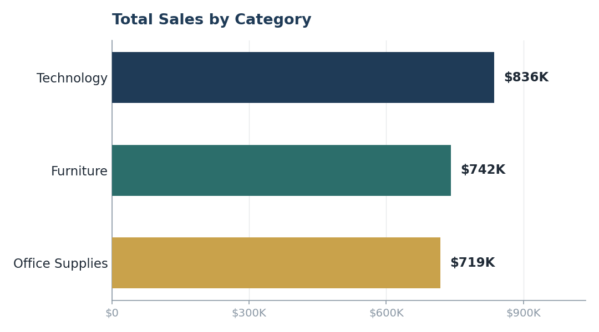
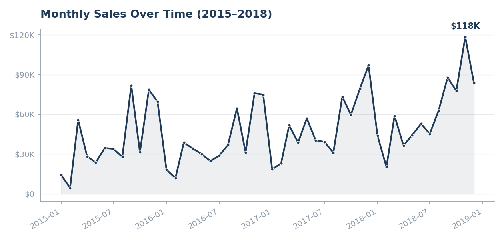
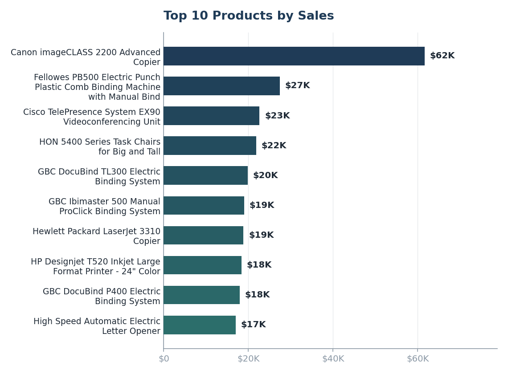
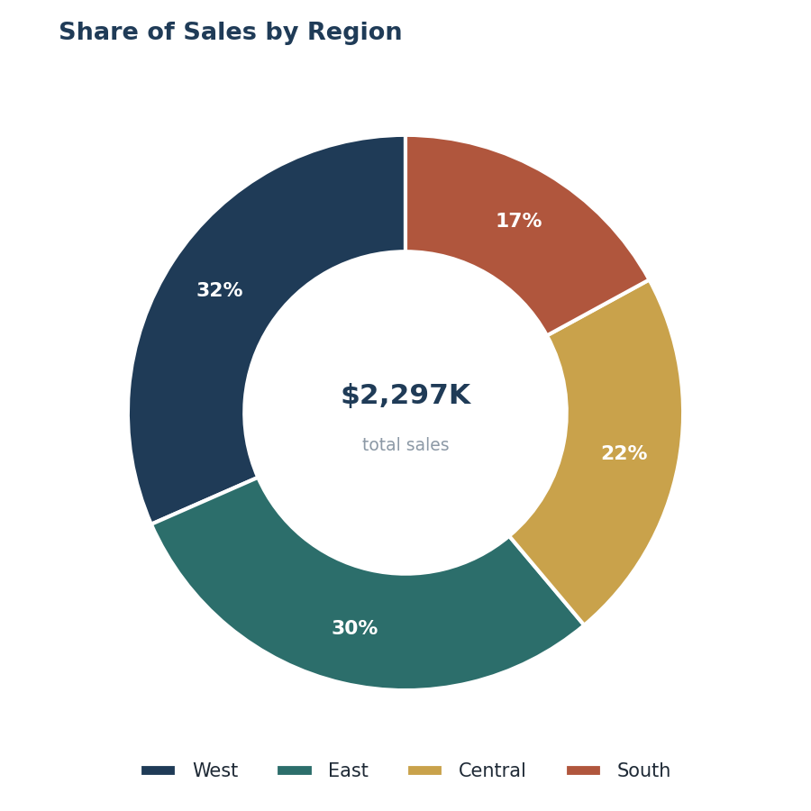
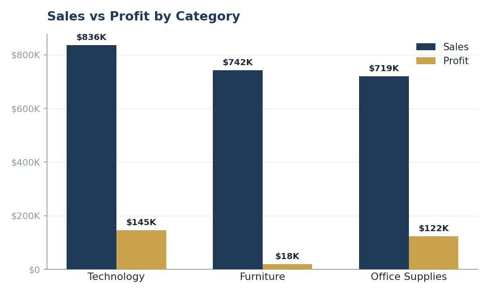

# Task 1: Basic Sales Data Analysis

**Name:** Nahla Nabil
**Track:** Data Analyst Internship, VOLTIX
**Dataset:** Sample Superstore sales data (`Sales_Dataset.csv`), 9,994 orders from Jan 2015 to Dec 2018
**Tools used:** Python (Pandas, Matplotlib)

---

## 1. Data Cleaning

| Check | Result | Action taken |
|---|---|---|
| Missing values | Only `Postal Code` had nulls (11 of 9,994 rows). Every column actually used in this analysis (Order Date, Category, Region, Sales, Quantity, Profit, Product Name) was 100% complete. | Filled the 11 missing `Postal Code` values with a placeholder (0). The column isn't used anywhere below, so this doesn't affect any result. |
| Duplicate rows | 0 fully duplicated rows. | None needed. |
| Data types | `Order Date` and `Ship Date` were stored as text; `Sales`, `Quantity`, `Discount` and `Profit` were already numeric. | Converted both date columns to proper `datetime`, then re-validated the four numeric columns with `pd.to_numeric` (0 rows failed). |
| Invalid values | Checked for negative `Sales` and zero/negative `Quantity`. | None found, so no rows were removed on this basis. |

The full step-by-step log, with row counts at every check, is in [analysis_output.txt](analysis_output.txt), produced by [analysis.py](analysis.py). The cleaned dataset is saved as [Sales_Dataset_Cleaned.csv](Sales_Dataset_Cleaned.csv).

---

## 2. Data Analysis: Answers

| # | Question | Answer |
|---|---|---|
| 1 | Total Sales | **$2,297,200.86** |
| 2 | Total Profit | **$286,397.02** (12.5% overall margin) |
| 3 | Top Category by Sales | **Technology**, at $836,154.03 (36% of all sales) |
| 4 | Best-selling Product | By **revenue**: Canon imageCLASS 2200 Advanced Copier ($61,599.82). By **units sold**: Staples (215 units) |
| 5 | Top Region by Sales | **West**, at $725,457.82 (31.6% of all sales) |
| 6 | Best Sales Month | Best single month on record: **November 2018** ($118,447.83). Best calendar month overall, across all years combined: **November** ($352,461.07) |

Full breakdowns (sales by category, region and month, plus the top 5 products two different ways) are printed in [analysis_output.txt](analysis_output.txt).

---

## 3. Visualizations

| Chart | File |
|---|---|
| Total Sales by Category | `charts/01_sales_by_category.png` |
| Monthly Sales Over Time (2015–2018) | `charts/02_sales_over_time.png` |
| Top 10 Products by Sales | `charts/03_top_10_products.png` |
| Share of Sales by Region | `charts/04_sales_by_region.png` |
| Sales vs Profit by Category (bonus) | `charts/05_sales_vs_profit_by_category.png` |

---

## 4. Insights

1. **Technology drives the most revenue, but Office Supplies is just as profitable.** Technology leads sales at $836K, but its margin isn't actually any better than Office Supplies. Both categories convert roughly 17% of sales into profit, so Technology's lead comes mainly from a handful of high-ticket items like copiers and video-conferencing units, not from stronger performance across the board.

2. **Furniture sells well but barely makes money.** Furniture is the #2 category by revenue ($742K, only about 13% behind Technology), but its profit margin is just **2.5%**, compared to roughly 17% for the other two categories. That's only $18.5K in profit on $742K of sales.

3. **Tables and Bookcases are actively losing money.** Drilling into sub-categories shows why: `Tables` lost $17,725 overall and `Bookcases` lost $3,473, both sold at a net loss despite generating real revenue behind them ($207K and $115K respectively). That's the direct cause of Furniture's weak margin above, and a clear place to review pricing and discounting.

4. **Sales are heavily seasonal, peaking at year-end.** November and December are consistently the two strongest calendar months ($352K and $325K, aggregated across all four years), and the single best month on record is November 2018. It looks like a holiday-driven demand spike worth planning inventory and promotions around.

5. **The West region outsells the South by nearly 2x.** West ($725K, 31.6% of sales) and East ($679K, 29.5%) together generate over 60% of total sales, while South trails at just $392K, or 17.1%. That gap looks like a real opportunity for targeted growth efforts in the South.

---

## 5. Data Source

This is the widely-used public "Sample Superstore" dataset, with 9,994 orders and fields including Order Date, Category, Region, Quantity, Sales and Profit. The same dataset is mirrored on Kaggle as
[Superstore Dataset (vivek468/superstore-dataset-final)](https://www.kaggle.com/datasets/vivek468/superstore-dataset-final).

---

## 6. Files in This Submission

- `Sales_Dataset.csv`: the original raw dataset
- `Sales_Dataset_Cleaned.csv`: the cleaned dataset used for analysis
- `analysis.py`: the full Python analysis script (cleaning, analysis and charts)
- `analysis_output.txt`: the captured console output / step-by-step results log
- `Sales_Analysis_Report.md`: this report (Markdown version)
- `Sales_Analysis_Report.pdf`: this report, designed PDF version
- `Sales_Analysis_Summary.xlsx`: Excel workbook with summary pivot tables
- `charts/`: the 5 PNG charts referenced above
