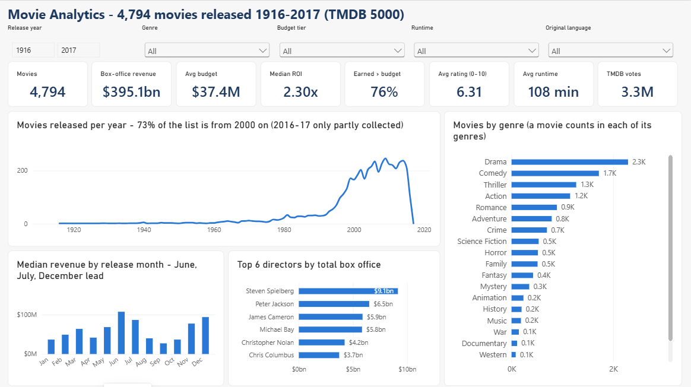
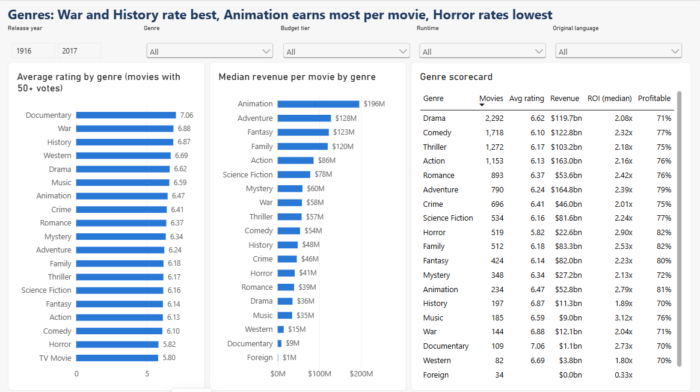
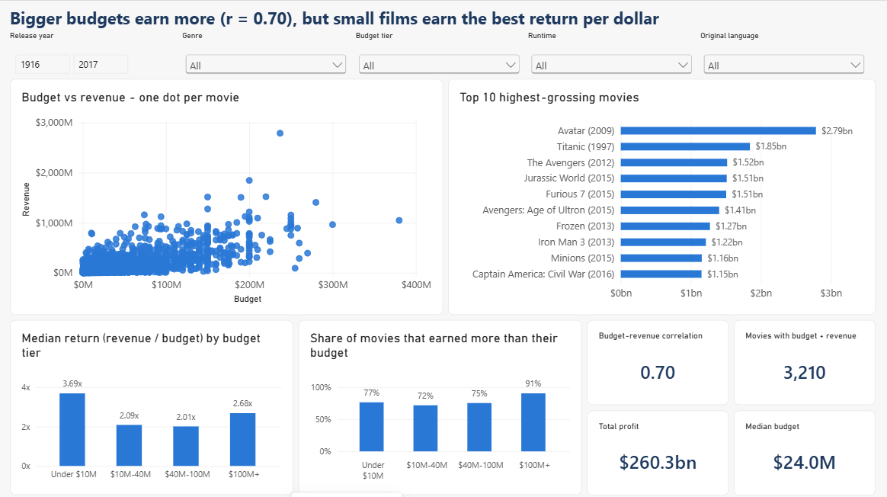
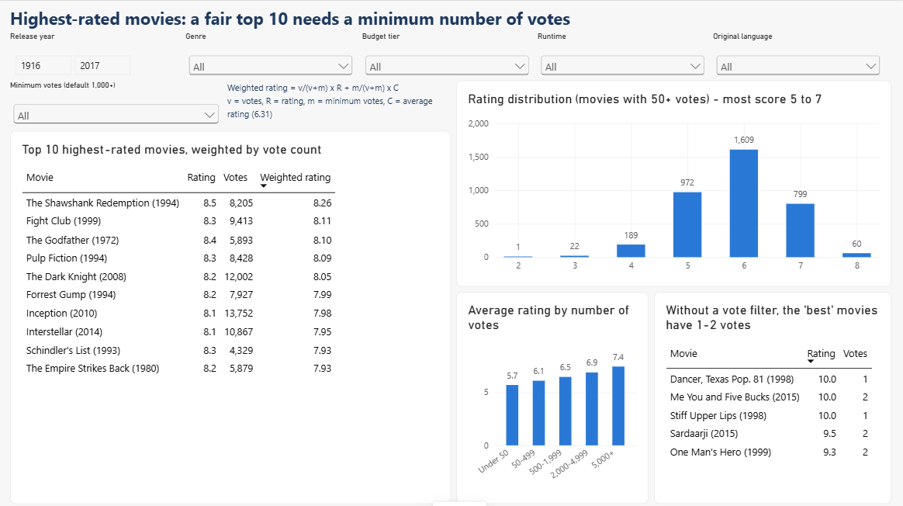
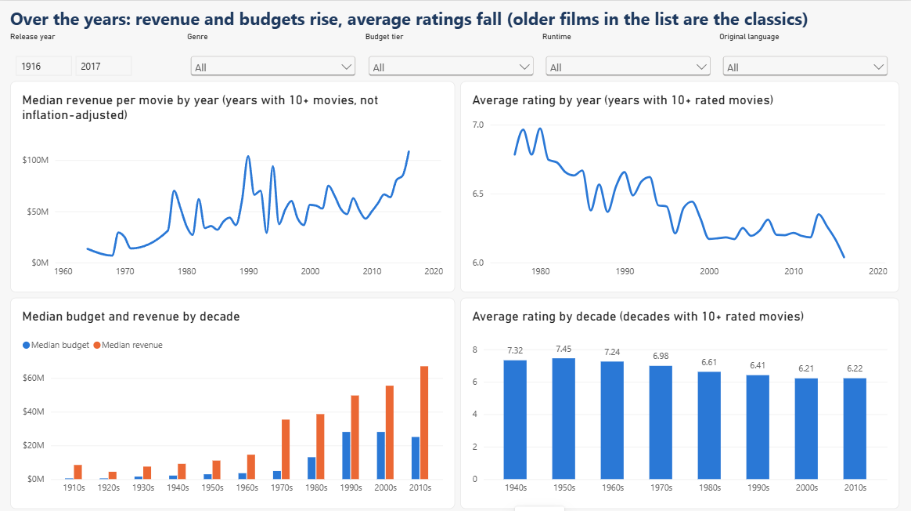
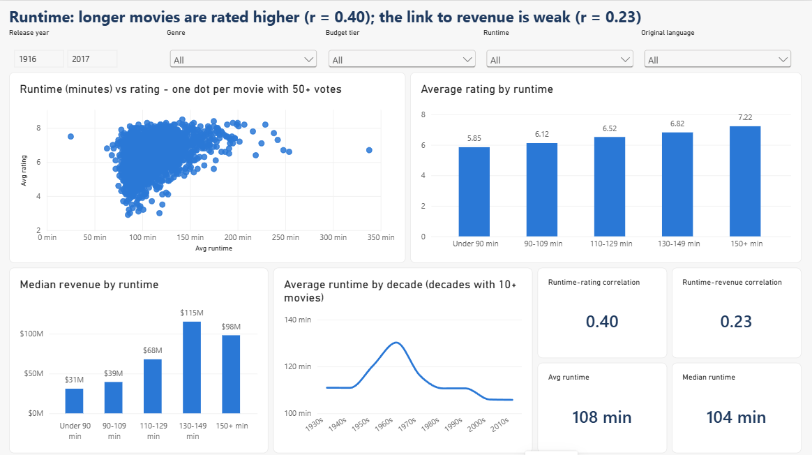
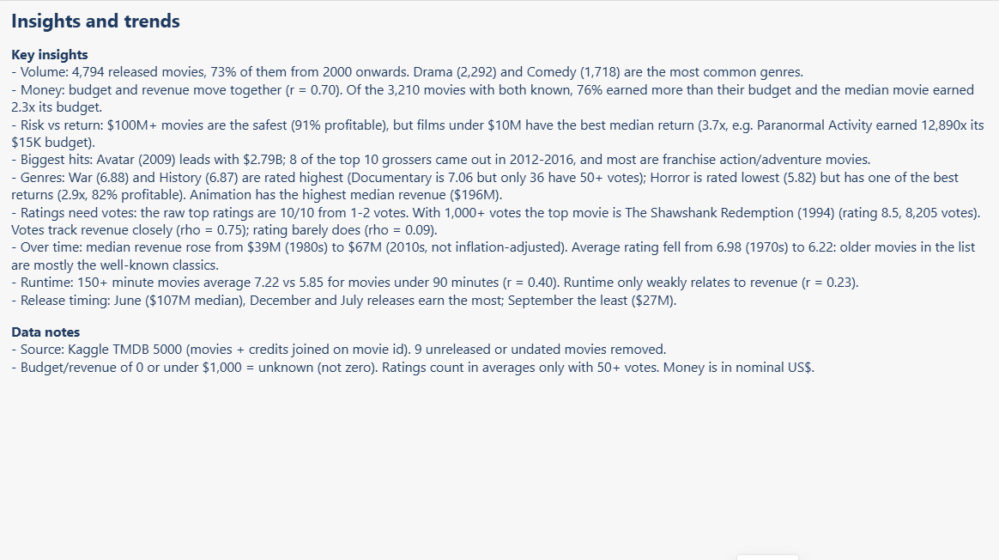

# Task 10: Movie Analytics Dashboard

An interactive Power BI dashboard built on the **TMDB 5000** movie dataset (4,803 movies with budget, revenue, genres, ratings, runtime, cast and crew).
It looks at what goes with a movie's success: genre, budget, timing, runtime and ratings.

**Start here:** open `Movie_Dashboard.pbix` in Power BI Desktop. It has 7 pages, and 5 slicers (year range, genre, budget tier, runtime, language) are synced across them.

| File | What it is |
|---|---|
| `tmdb_5000_movies.csv`, `tmdb_5000_credits.csv` | Raw input from Kaggle (unchanged) |
| `clean_data.py` | Joins the two files and cleans them, writing `movies_clean.csv` (one row per movie) and `movie_genres.csv` (one row per movie-genre pair) |
| `analysis.py` | Prints every number used in the findings (KPIs, genre table, correlations, top 10s) |
| `build_powerbi.py` | Builds the Power BI project: data model, 28 DAX measures, 7 pages |
| `Movie_Dashboard.pbix` | **The dashboard** |
| `screenshots/` | One image per dashboard page |

## Dashboard pages

| Page | Answers |
|---|---|
| Overview | 8 KPIs, movies released per year, movies by genre, revenue by release month, top directors |
| Genres | Average rating and median revenue by genre, plus a genre scorecard (rating, revenue, ROI, % profitable) |
| Budget & Revenue | Budget vs revenue scatter, top 10 highest-grossing movies, return and success rate by budget tier |
| Ratings | Top 10 by **weighted rating** (a slicer sets the minimum votes), rating distribution, why vote count matters |
| Trends | Revenue, budget and rating over the years and decades |
| Runtime | Runtime vs rating and revenue, with correlations |
| Insights | The findings below, plus data notes |

## Cleaning decisions

- **Joined** movies and credits on the movie id (all 4,803 match). From the credits I kept the **director** and the **lead actor**.
- **Removed 9 movies:** 8 were not released yet (Rumored / Post Production) and 1 had no release date. **4,794 remain.**
- **Budget or revenue of 0 means "not recorded", not zero.** 1,031 budgets and 1,419 revenues are 0. Another 54 values under $1,000 (such as `7` or `30`, typed in millions) were also set to unknown.
  Money metrics use only known values, and ROI and profit need both, which leaves 3,210 movies.
- **Ratings with very few votes are unreliable** (the raw top 5 are rated 9.3–10 from 1–2 votes). Averages use only movies with **50+ votes** (3,652 movies).
- **Genres:** a movie has 1–7 genres, so they are stored in a separate table. A movie counts once in each of its genres. 27 movies have no genre.
- Runtime of 0 was set to unknown (35 movies). 2016 is only partly covered and 2017 has 1 movie, because the data was collected in early 2017.

## Weighted rating

Ranking by raw rating puts 1-vote movies at the top. Like IMDb's Top 250, the dashboard uses this score:
**Weighted rating = v/(v+m) × R + m/(v+m) × C**, where v = votes, R = the movie's rating, m = minimum votes (1,000 by default) and C = the average rating (6.31).
With few votes a movie is pulled towards the average, and only movies with at least m votes are ranked.

## Key insights

- **Volume:** 73% of the movies are from 2000 onwards. Drama (2,292) and Comedy (1,718) are the most common genres.
- **Budget and revenue:** bigger budgets earn more (**r = 0.70**). Of the 3,210 movies with both known, **76% earned more than their budget**, and the median movie earned **2.3×** its budget.
- **Risk vs return:** **$100M+ movies are the safest (91% profitable)**, but **movies under $10M have the best median return (3.7×)**. Paranormal Activity earned 12,890× its $15K budget.
- **Highest-grossing:** Avatar (2009, $2.79B), Titanic and The Avengers lead. 8 of the top 10 came out in 2012–2016, mostly franchise action and adventure movies.
- **Genres:** War (6.88) and History (6.87) are rated highest. Documentary averages 7.06, but only 36 have 50+ votes. Horror is rated lowest (5.82) but still returns 2.9× its budget, with 82% profitable.
  Animation has the highest median revenue ($196M).
- **Highest-rated (1,000+ votes):** The Shawshank Redemption (8.26 weighted), Fight Club, The Godfather, Pulp Fiction, The Dark Knight.
  Vote count tracks revenue closely (ρ = 0.75), but rating barely does (ρ = 0.09). Popular is not the same as well rated.
- **Over time:** median revenue per movie rose from $39M (1980s) to $67M (2010s, not inflation-adjusted). The average rating fell from 6.98 (1970s) to 6.22 (2010s), because old movies in the list are mostly the classics that are still remembered.
- **Runtime:** longer movies are rated higher (**r = 0.40**). Movies of 150+ minutes average 7.22, against 5.85 for movies under 90 minutes. The link to revenue is weak (r = 0.23).
- **Release timing:** June ($107M median), December and July releases earn the most. September earns the least ($27M).

**Limitations:** this list contains mostly well-known, English-language (94%) movies, so it is not every movie ever made.
Money is in nominal dollars (not adjusted for inflation). Correlation does not show cause: longer, bigger movies are often prestige or franchise films.

## Screenshots









## Re-run

```bash
python clean_data.py && python analysis.py && python build_powerbi.py
```
Then open `PowerBI/Movie_Dashboard.pbip`, press **Refresh**, and save as `.pbix`. Requires pandas and scipy.
