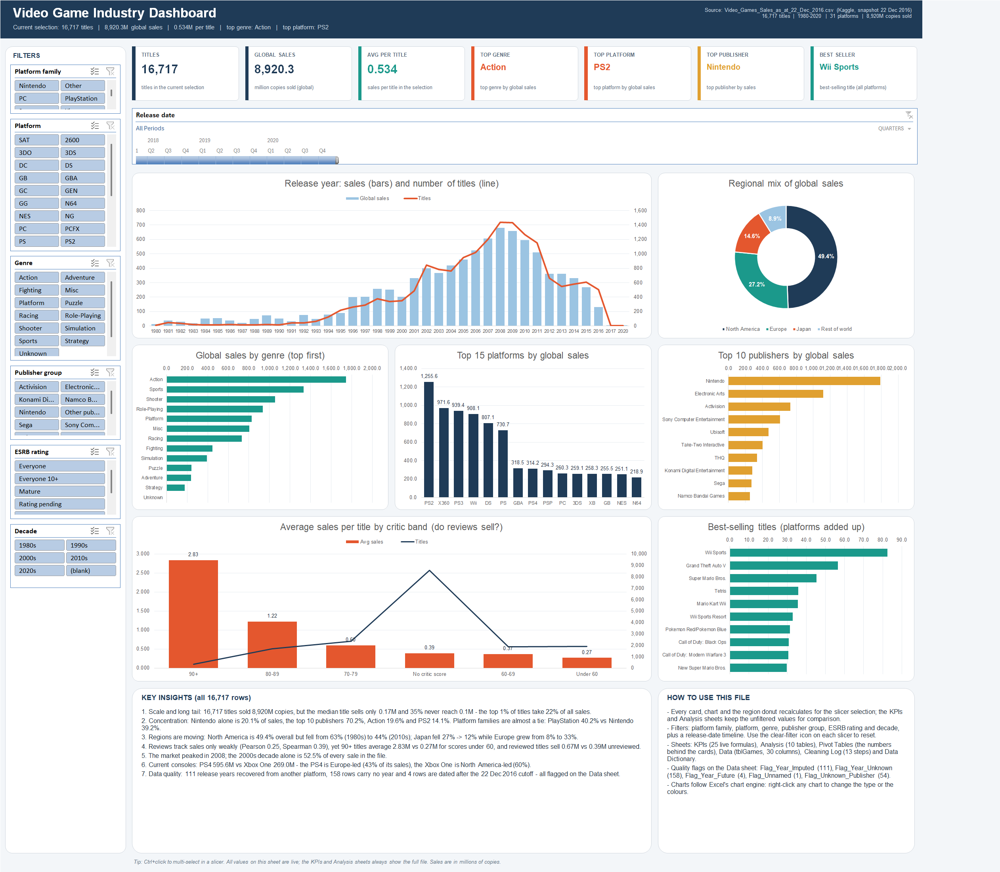
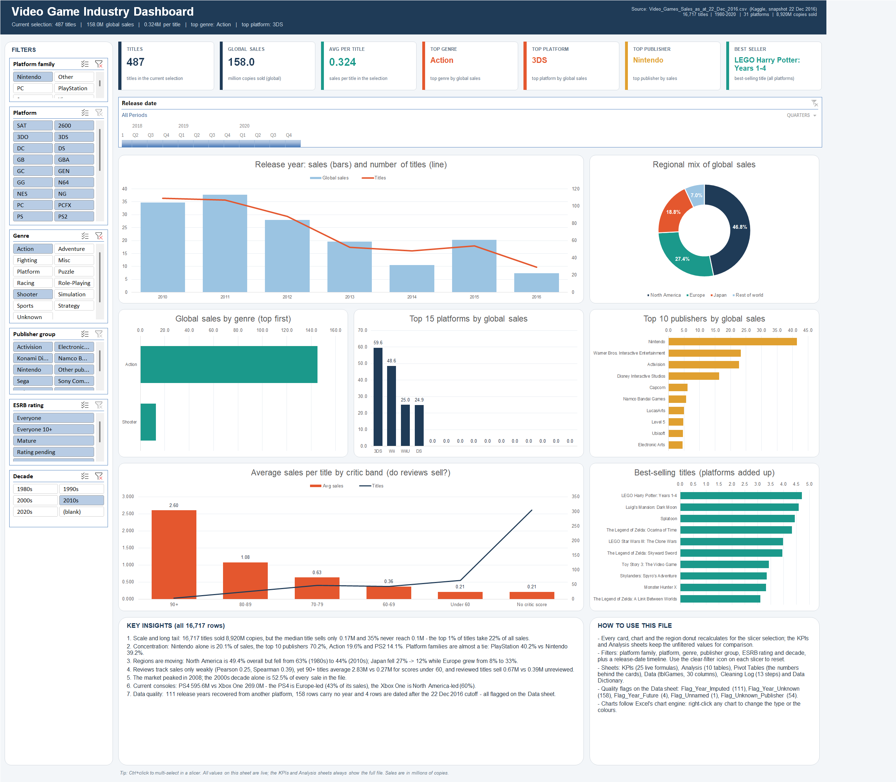

# Task 11: Video Game Industry Excel Dashboard

This task turns 16,719 raw video-game sales records (Kaggle snapshot, 22 Dec 2016) plus two console-sales files
(PS4: 1,034 rows, Xbox One: 613 rows) into an interactive Excel dashboard about the whole industry.

**Start here:** open `GameSales_Dashboard.xlsx`, go to the **Dashboard** sheet and use the slicers and the timeline.

If Excel opens it in Protected View, click **Enable Editing** so the slicers work.
Then read the **KEY INSIGHTS** panel on the dashboard or `KEY_INSIGHTS.md`.

`GameSales_Base.xlsx` is the same workbook without the interactive layer (formulas, tables and charts only).

## Workbook contents

| Sheet | Contents |
|---|---|
| **Dashboard** | 7 KPI cards and 7 charts. 6 slicers (Platform family, Platform, Genre, Publisher group, ESRB rating, Decade) and a release-date **timeline** are connected to *all* pivots. A header line shows the current selection against the full file. |
| **KPIs** | 25 live formulas with their logic and purpose |
| **Analysis** | 10 formula tables (genre, platform, publisher, year, decade, regions, ratings, consoles) with colour scales |
| **Pivot Tables** | The 7 pivot tables behind the dashboard, plus the `GETPIVOTDATA` / `INDEX-MATCH` formulas that feed the KPI cards |
| **Data** | The cleaned Excel table `tblGames`: 16,717 rows × 30 columns (quality flags included) |
| **Cleaning Log** / **Data Dictionary** | Every check, finding and action taken in 13 steps, and every column with its source |

## Cleaning summary

- **16,719 → 16,717 rows:** 2 duplicate rows removed (Name + Platform + Year pairs, kept the higher-selling row); 0 exact-duplicate rows.
- **1 unnamed title** kept with `Flag_Unnamed`, genre set to `Unknown` so it still appears in the pivots.
- **Missing years:** 111 recovered from the same title on other platforms (all known years agree), 158 left blank with `Flag_Year_Unknown` (excluded from the yearly trend).
- **4 rows dated after the 22 Dec 2016 cutoff** (2017–2020) kept with `Flag_Year_Future`, excluded from the trend.
- **54 rows without publisher** set to `Unknown publisher` (kept in the totals, flagged); 6,622 rows have no developer (kept, display only).
- Sales additivity checked: only 8 rows differ by at most 0.02M (source rounding) — published `Global_Sales` kept.
- **Ratings:** 8,581 rows with no critic score, 8,709 rated by critics or users; 6,769 missing ESRB ratings grouped as `Unknown`.
- Console files (latin-1): announced-title repeats with 0.00M sales removed → PS4 1,031 rows, Xbox One 612 rows.

## Headline results

- **16,717 titles, 8,920.3M copies**, median title only 0.17M; the top 1% of titles take 22% of all sales.
- **Concentration:** Nintendo is 20.1% of sales, the top 10 publishers 70.2%, Action 19.6%, PS2 14.1%. Platform families are almost a tie: PlayStation 40.2% vs Nintendo 39.2%.
- **Regions are moving:** North America is 49.4% overall but fell from 63% (1980s) to 44% (2010s); Europe grew from 8% to 33%.
- **Reviews track sales weakly** (Pearson 0.25, Spearman 0.39), yet 90+ titles average 2.83M vs 0.27M under 60.
- The market **peaked in 2008**; the 2000s decade is 52.5% of every sale in the file.
- **PS4 595.6M vs Xbox One 269.0M** — the PS4 is Europe-led (43%), the Xbox One North America-led (60%).

## Pipeline (to rebuild)

`clean_data.py` → `analysis.py` + `make_charts.py` (EDA, 10 matplotlib charts in `charts/`) → `build_workbook.py` (openpyxl: data, KPI formulas, analysis) → `build_dashboard.py` (Excel COM: pivots, charts, slicers, timeline, dashboard) → `export_screenshots.py` (captures the dashboard and tests the slicers)

## Screenshots

