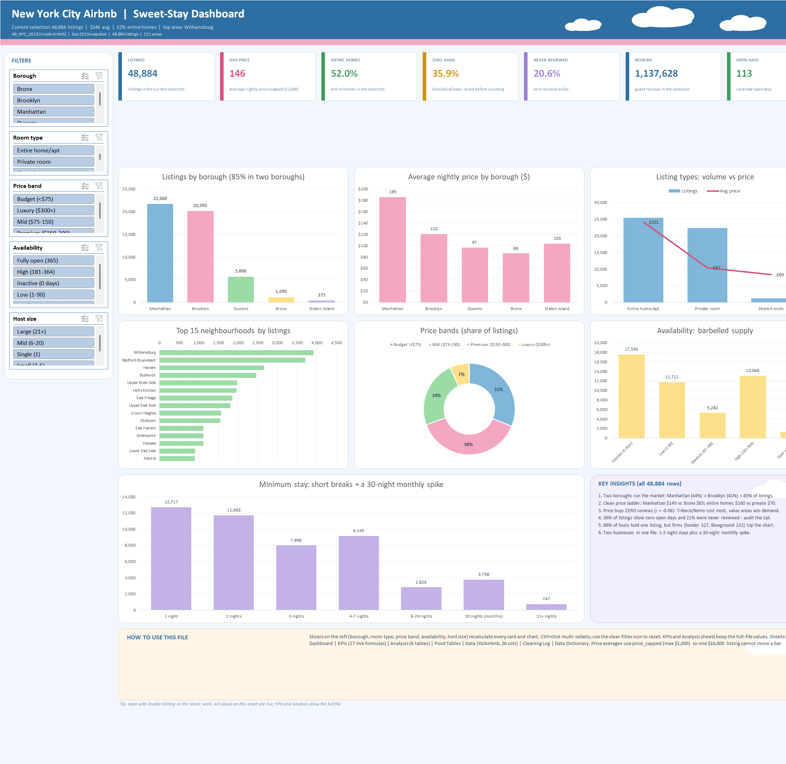
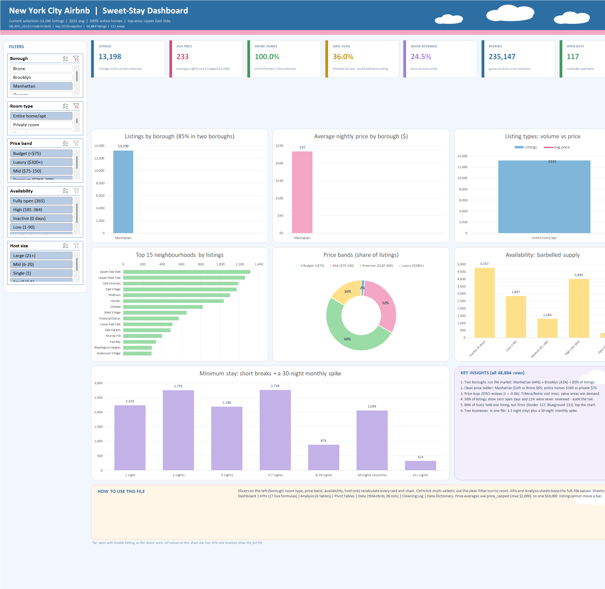

# Task 12: New York City Airbnb — Final Data Analysis Project

Full end-to-end analysis of **48,884 NYC Airbnb listings** (September 2019 snapshot):
understand, clean, analyse, visualise, dashboard, insights, recommendations.

**Start here:** open `Airbnb_NYC_Dashboard.html` in a browser — 8 KPI cards, 7 interactive
charts (legend slicers, metric-switch buttons, borough filter, sortable table) and a listing map.
The map basemap needs internet for its tiles; every chart works offline (plotly.js is embedded).

Prefer Office? Open **`Airbnb_Dashboard.xlsx`** (enable editing so the slicers work) — same story in
candy colours with clouds: 7 KPI cards, 7 pivot charts, 5 slicers and insight panels.

Then read `FINAL_REPORT.md` (the complete project report) and `KEY_INSIGHTS.md` (findings + decisions).

## Files

| File | Contents |
|---|---|
| `data_raw/AB_NYC_2019.csv` | Raw dataset, never modified (48,895 rows × 16 columns) |
| `Cleaned_AB_NYC_2019.csv` | Cleaned + engineered data (48,884 rows × 30 columns) |
| `clean_data.py` | Cleaning pipeline (raw → cleaned + `cleaning_log.json`) |
| `analysis.py` | EDA pipeline (cleaned → `analysis_summary.json`) |
| `make_charts.py` | 12 matplotlib charts in `charts/` |
| `build_dashboard.py` | Builds the self-contained Plotly dashboard |
| `build_excel_base.py` | Base workbook: `Airbnb_Base.xlsx` (tblAirbnb + 17 KPI formulas + 6 analysis tables + logs) |
| `build_excel_dashboard.py` | Excel COM layer: 7 pivots, 7 charts, 5 slicers, candy+clouds design → `Airbnb_Dashboard.xlsx` |
| `Airbnb_NYC_Dashboard.html` | Interactive dashboard (KPIs, filters, map, table) |
| `Airbnb_Dashboard.xlsx` | Excel dashboard (same story, pivots + slicers + clouds) |
| `FINAL_REPORT.md` | Final report: overview → cleaning → analysis → dashboard → insights → recommendations |
| `KEY_INSIGHTS.md` | KPI scorecard, findings, recommendations |
| `cleaning_log.json` / `analysis_summary.json` | Machine-readable cleaning record and every reported number |

## Screenshots




The filtered shot proves the slicers drive everything: 13,198 listings, $233 avg, 100% entire homes,
top area Upper East Side.

## Rebuild (to verify)
```
python "Task 12/clean_data.py"       # raw -> Cleaned_AB_NYC_2019.csv
python "Task 12/analysis.py"         # cleaned -> analysis_summary.json
python "Task 12/make_charts.py"      # cleaned -> charts/*.png
python "Task 12/build_dashboard.py"  # cleaned -> Airbnb_NYC_Dashboard.html
python "Task 12/build_excel_base.py"       # cleaned -> Airbnb_Base.xlsx
python "Task 12/build_excel_dashboard.py"  # base -> Airbnb_Dashboard.xlsx (needs Excel)
```

Excel notes: open `Airbnb_Dashboard.xlsx` with **Enable Editing** so the slicers work.
Two deliberate compromises are documented in the workbook: the `== Modern, A/C ...` listing name
is stored as forced text (openpyxl would otherwise write it as a broken formula and Excel refuses
the file), and Hosts on the KPIs sheet is a static 37,455 (a live distinct-count over 48,884 rows
freezes Excel; every Dashboard card stays a live formula).

## Cleaning summary

- **48,895 → 48,884 rows:** 11 rows with `price == 0` removed (impossible nightly price, 0.02%).
  No duplicate rows or ids.
- **Missing names/hosts:** 16 missing listing names → `Unnamed listing`, 21 missing host names →
  `Unknown host`, both flagged.
- **Missing reviews:** 10,052 rows missing `last_review`/`reviews_per_month` are *exactly* the
  zero-review rows (verified 1:1) → `reviews_per_month = 0`, `flag_never_reviewed = 1`.
- **Outliers kept, flagged:** 239 listings over $1,000 (max $10,000) kept with
  `flag_price_outlier`; means/correlations use price ≤ $1,000. 43 rows demanding ≥ 365 minimum
  nights kept with `flag_min_nights_extreme`.
- **Engineered:** `price_band`, `avail_segment`, `host_size`, `booked_proxy`
  (= 365 − availability_365), `revenue_proxy` (= price × booked_proxy), plus Excel helpers
  `price_capped`, `is_entire_home`, `is_zero_avail`, `stay_bin`.

## Headline results

- **Two boroughs run the market:** Manhattan (44.3%) + Brooklyn (41.1%) = 85% of listings.
- **Price ladder is steep:** Manhattan median **$149** vs Bronx **$65**; entire homes **$160** vs
  private rooms **$70** vs shared **$45**.
- **Price does not buy reviews** (r = −0.06); priciest pockets (Tribeca $282, NoHo $250) average
  the fewest reviews — reviews follow value, not luxury.
- **36% of listings show zero open days** and 21% were never reviewed — audit both before
  counting them as live supply.
- **Hosts are small, supply is not concentrated:** 86% of hosts hold one listing (66% of listings);
  only 4.5% of listings sit with 21+ listing operators — but the top two (Sonder 327, Blueground 232)
  are professional firms, a different competitive animal.
