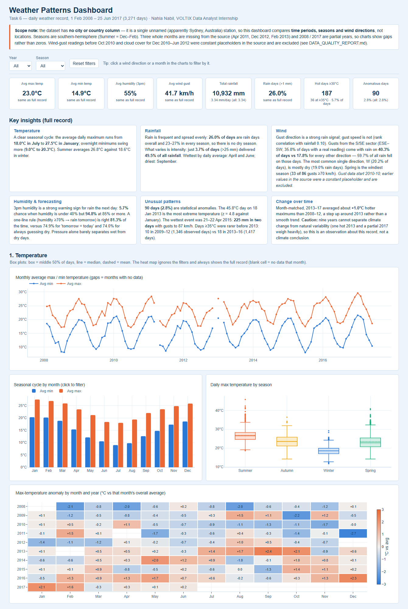
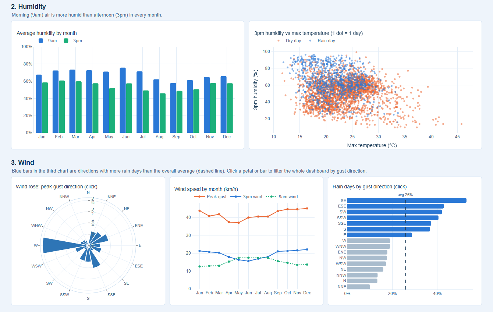
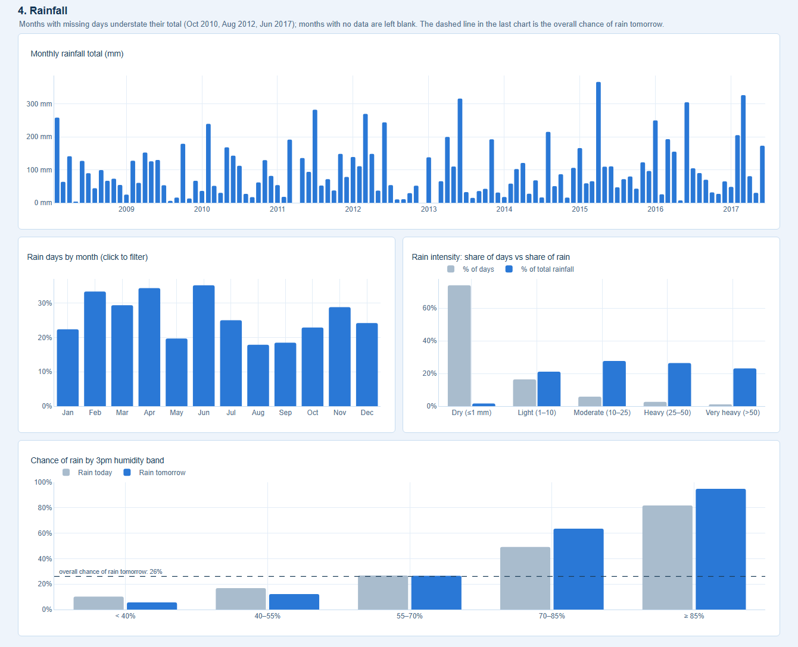
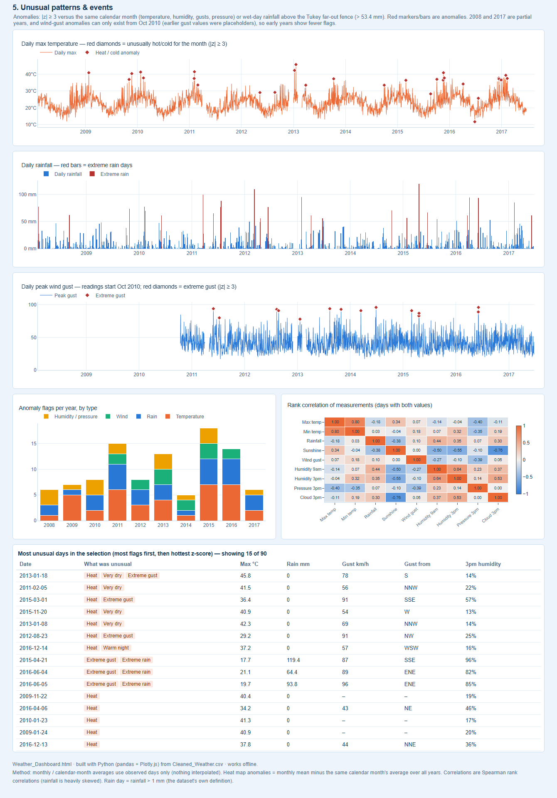
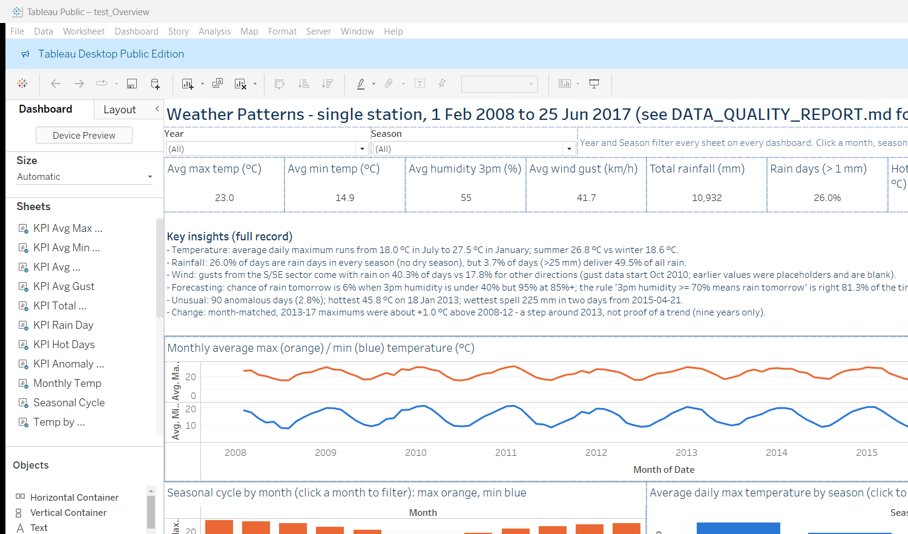
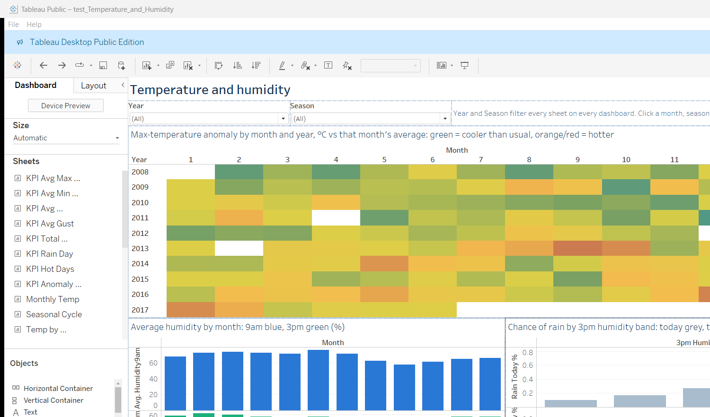
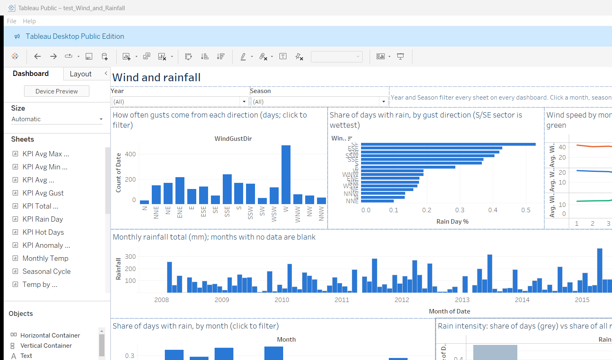
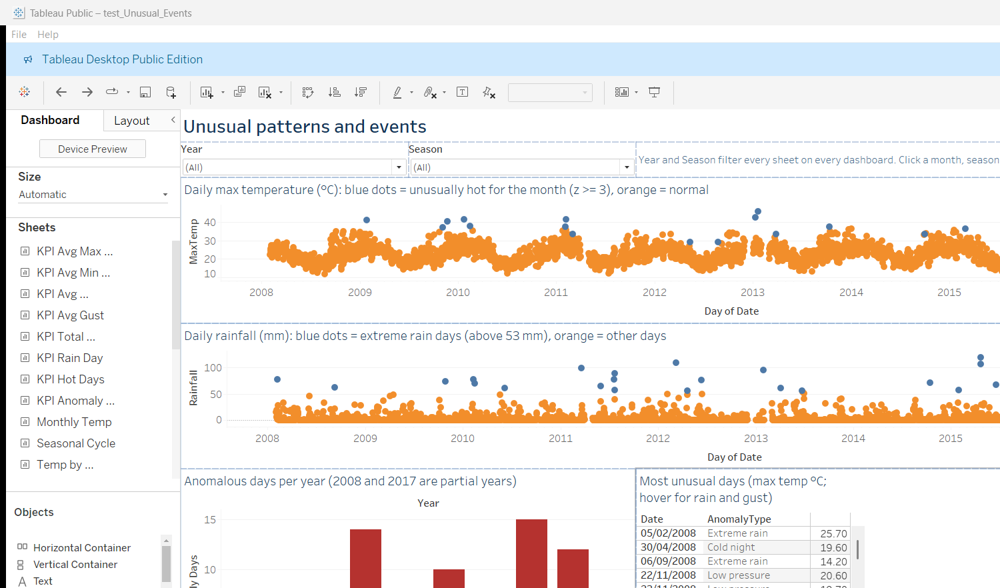

# Task 6 - Weather & Climate Patterns

Daily weather record (3,271 days, 1 Feb 2008 - 25 Jun 2017). One unnamed station, apparently Sydney - the file has no city/country column, so
time periods, seasons and wind directions are compared, not locations. Read `DATA_QUALITY_REPORT.md` first for the data caveats.

| File | What it is |
|---|---|
| `Weather_Data.csv` / `Cleaned_Weather.csv` | raw input / cleaned + engineered data |
| `DATA_QUALITY_REPORT.md` | checks, placeholder blocks removed, gaps |
| `KEY_INSIGHTS.md` | KPIs, findings and recommendations |
| `Weather_Dashboard.html` | interactive dashboard (Plotly, works offline) |
| `Weather_Dashboard.twbx` | Tableau workbook (4 dashboards) - see `Tableau_Guide.md` |
| `Power_BI_Guide.md` | steps and DAX to rebuild it in Power BI |
| `clean_and_validate.py`, `analysis.py`, `write_key_insights.py`, `build_dashboard.py`, `build_tableau.py`, `build_twb.py` | the pipeline, in run order |

## Screenshots

### Interactive HTML dashboard (`Weather_Dashboard.html`)

### Tableau workbook (`Weather_Dashboard.twbx`)

Captured from the Tableau Public window, so they show only the part of each dashboard that fits on screen (not the full layout).

