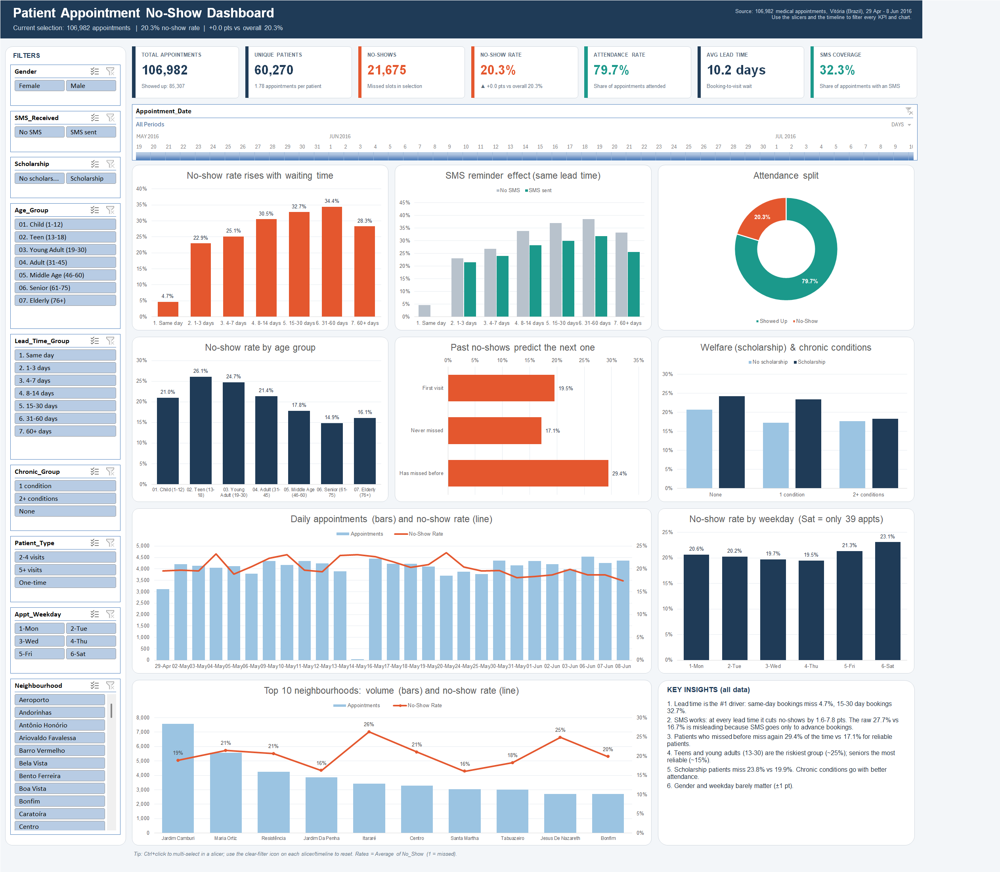
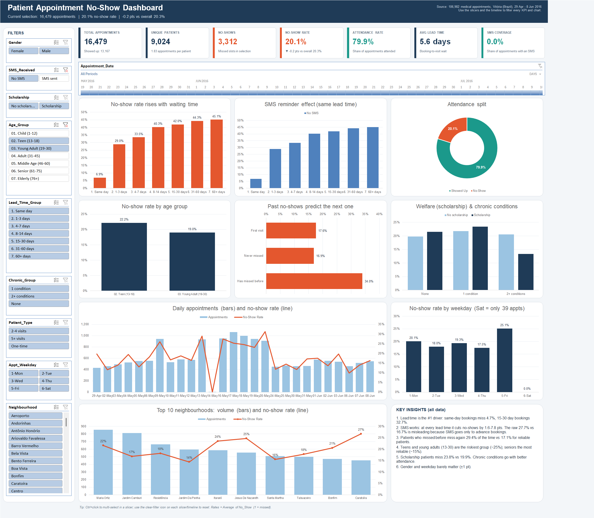

# Task 8: Healthcare No-Shows Excel Dashboard

This task turns 106,987 raw medical appointments from Vitória, Brazil (2016) into an interactive Excel dashboard.
The dashboard explains who misses appointments and why.

**Start here:** open `Healthcare_NoShows_Dashboard.xlsb`, go to the **Dashboard** sheet and use the slicers and the timeline.

The workbook is saved as an **Excel Binary Workbook (.xlsb)**. It has all the same features as .xlsx (pivots, slicers, timeline, formulas) at half the size: 8.4MB instead of 17.6MB. That keeps the submission under the 10MB upload limit.
If Excel opens it in Protected View, click **Enable Editing** so the slicers work.
Then read the **Insights** sheet or `KEY_INSIGHTS.md`.

The submission zip leaves out the two CSVs (raw data and `Cleaned_NoShows.csv`) to stay under the limit. The cleaned data is still in the workbook's **Data** sheet, and both CSVs are in this repository.

## Workbook contents

| Sheet | Contents |
|---|---|
| **Dashboard** | 7 KPI cards and 9 pivot charts. 9 slicers (Gender, SMS, Scholarship, Age group, Lead time, Chronic conditions, Patient type, Weekday, Neighbourhood) and an appointment-date **timeline** are connected to *all* pivots. A header line shows the current selection against the overall rate. |
| **Insights** | 6 findings and 5 recommendations |
| **KPIs** | 23 KPIs as live formulas (`COUNTIFS` / `SUMIFS` / `AVERAGEIF`), each with its logic and its purpose |
| **Analysis** | 18 formula tables (appointments, no-shows, rate, share of no-shows, risk index) for each factor, with colour scales. Includes the SMS × lead-time matrix. |
| **Pivot Tables** | The 10 pivot tables behind the dashboard, plus the `GETPIVOTDATA` formulas that feed the KPI cards |
| **Data** | The cleaned Excel table `tblAppointments`: 106,982 rows × 32 columns |
| **Cleaning Log** / **Data Dictionary** | Every check, finding and action taken, and every column with its source |

## Cleaning summary

- The data has no nulls, no blanks and no duplicate appointment IDs.
- **5 rows removed:** the booking date was *after* the appointment date (negative lead time).
- 5 Patient IDs were corrupted into decimals by a float export. They are flagged, and all IDs are now stored as text.
- 5 bookings with age 115 (2 patients) are flagged. They are kept, because the appointment data itself is valid.
- The misspelled columns `Hipertension` → `Hypertension` and `Handcap` → `Handicap` were renamed, and `Date.diff` → `Lead_Days`.
  Neighbourhood names were set to Title Case, and TRUE/FALSE values became Yes/No.
- 11,024 same-day multi-bookings are flagged, not removed, because each has its own Appointment_ID.
- **Derived columns:** No_Show (1/0), Age_Group, Lead_Time_Group, weekday and month, chronic-condition count, and patient history
  (visit number, prior no-shows, patient type). `First_Appt` is also derived: its sum gives the number of unique patients under any filter.

## Headline results

- No-show rate: **20.3%**. It is **4.7%** for same-day bookings and **32.7%** for bookings 15–30 days ahead.
- **SMS paradox:** taken overall, SMS looks harmful (27.7% vs 16.7%). Compared within the same lead time, it lowers no-shows by 1.6–7.8 points.
- Patients who missed before miss again **29.4%** of the time, against 17.1% for the others.
- Ages 13–30 have the highest risk (about 25%). Scholarship patients miss 23.8%. Gender and weekday hardly matter.

## Pipeline (to rebuild)

`clean_data.py` → `build_workbook.py` (openpyxl: data, KPI formulas, analysis) → `build_dashboard.py` (Excel COM: pivots, pivot charts, slicers, timeline, dashboard)
→ `export_screenshots.py` (captures the dashboard and tests the slicers)

## Screenshots

