# Task 9: Customer Data Analysis

This task analyses 2,150 raw customer records (age, gender, purchases, product categories, ratings, dates from Oct 2022 to Jul 2025). The work runs from cleaning through findings:
**raw data → cleaning → KPIs and statistical tests → charts → interactive dashboard (HTML and Power BI) → summary of findings**.

**Start here:** open `Customer_Analysis_Summary.pdf` (5-page summary), then `Customer_Dashboard.html` in any browser (it works offline) or `Customer_Dashboard.pbix` in Power BI Desktop.

| File | What it is |
|---|---|
| `Customers_Fakedata.csv` | Raw input (unchanged) |
| `Cleaned_Customers.csv` | Cleaned data: 2,100 rows × 31 columns, with status flags and calculated columns |
| `Customer_Analysis_Summary.pdf` | **Short summary report**: KPIs, 6 findings with charts, recommendations, limitations |
| `Customer_Dashboard.html` | **Interactive dashboard**: 8 KPI cards, 14 charts, a segment scorecard, 9 filters plus click-to-filter, CSV export, light and dark mode |
| `Customer_Dashboard.pbix` | **Power BI report**: 5 pages, 30 DAX measures, 6 synced slicers. Its source project (`PowerBI/Customer_Dashboard.pbip`) is created by `build_powerbi.py` (see `Power_BI_Guide.md`) |
| `KEY_INSIGHTS.md` | KPI scorecard, 7 findings, relationships between variables (with significance tests), recommendations, limitations |
| `DATA_QUALITY_REPORT.md` | Every cleaning check, the evidence for it, and the decision taken |
| `charts/` | 8 static charts (PNG) used in the report |
| `clean_data.py` → `analysis.py` → `make_charts.py` → `build_dashboard.py` → `build_powerbi.py` → `export_screenshots.py` → `build_report.py` → `package_submission.py` | The pipeline, in run order. `cleaning_log.json`, `analysis_summary.json` and `analysis_output.txt` are intermediate outputs |

## Main cleaning decisions

- **50 exact duplicate rows** removed (all appended at the end of the file). A second `'  Gender  '` column (an exact copy) and an empty `Unnamed` column were dropped.
- **Age:** 1,099 placeholders (`-1`, `200`) and 506 blanks. Only 495 real ages (24%) remain. They were **not imputed**, because a median fill would invent 76% of the column.
- **Rating:** 291 values of `10` on a 1–5 scale were blanked (no 6–9 exist, so they cannot be rescaled). 1,487 valid ratings remain.
- **Date:** 118 impossible dates (`32/13/2020`) were blanked. The rows are kept for everything except the time analysis. Oct 2022 and Jul 2025 are partial months, so trends use the 32 full months.
- **Gender:** 6 spellings merged into Male / Female; 267 blanks became `Unknown`. Gender contradicts the first name in 50% of rows (flagged).
- **Category:** 565 blanks (27%) kept as `Unknown`. **Amount:** 97 blanks were not imputed. **Phone:** dropped, because it holds only two dummy numbers.
- Only **9.7%** of records are complete in every field, and the gaps are independent of each other. So each metric uses every row that is valid for it, instead of dropping incomplete rows.

## Headline results

- **Revenue:** $1.02M from 2,003 priced purchases, average order **$510**. Orders of **$750+ are 26% of orders but 45% of revenue**.
- **Satisfaction:** average **3.03 / 5**, with **39% dissatisfied and 39% satisfied**. The split is the same in every category, gender, age group and order size.
- **Trend:** flat, at about **60 purchases and $29K a month** (no trend, p = 0.48). January–June revenue moved +1.3% in 2024 and −2.6% in 2025.
- **Seasonality:** none. The August–September "dip" appears only because those months occur in 2 of the 3 years covered, and 2025-Q3 holds only 23 days.
- **Segments:** no difference by gender, age, category, weekday or email provider (none of 14 tests is significant). The file behaves like randomly generated data (uniform amounts and ages, gender unrelated to name), so flat results are the expected, honest answer.

## Screenshots

### HTML dashboard (`Customer_Dashboard.html`)
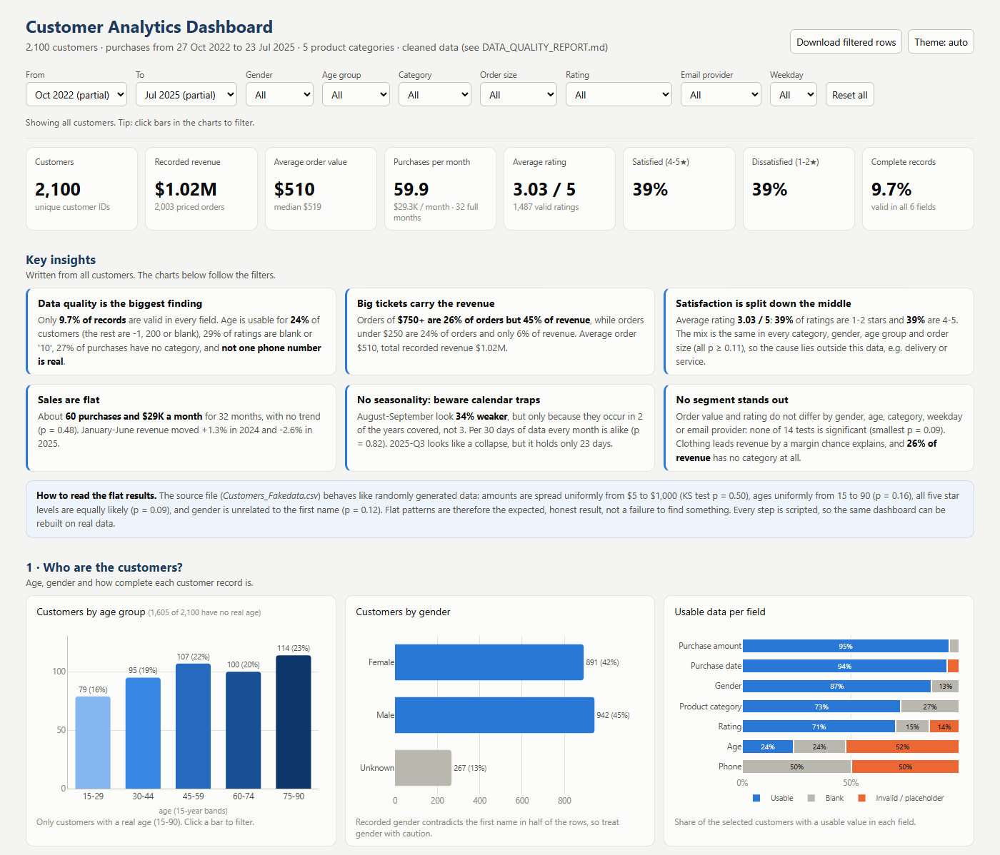
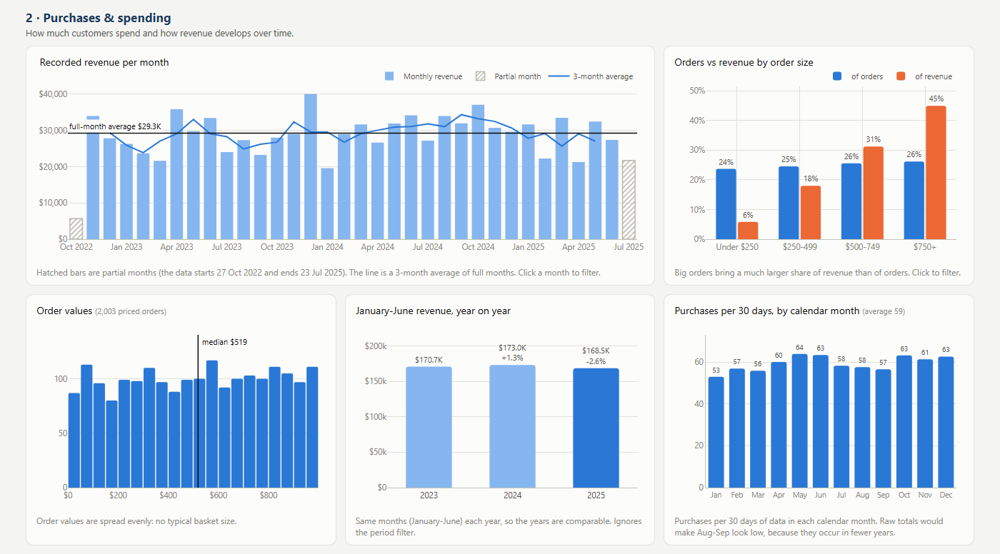
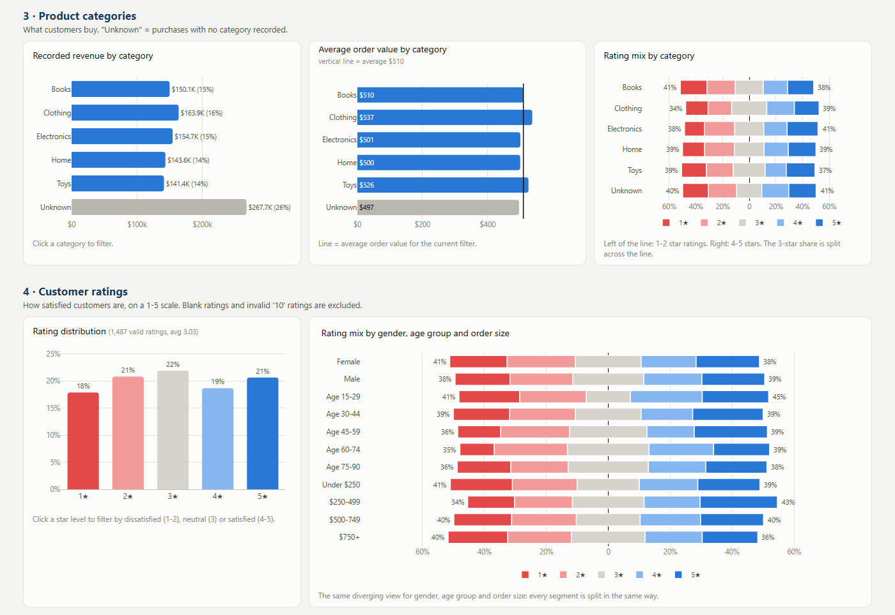
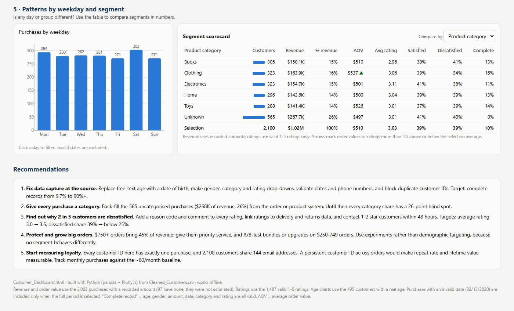
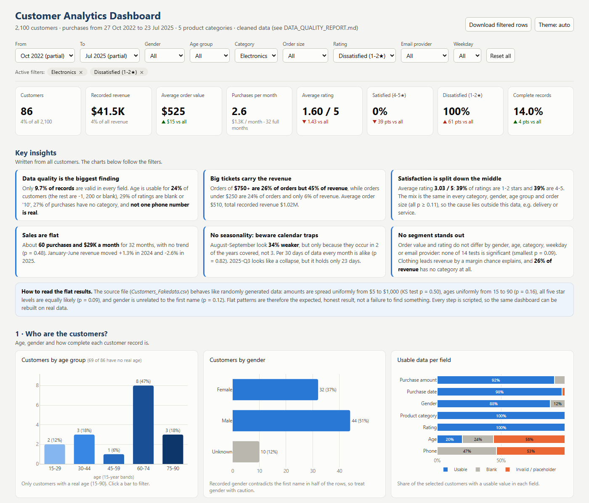
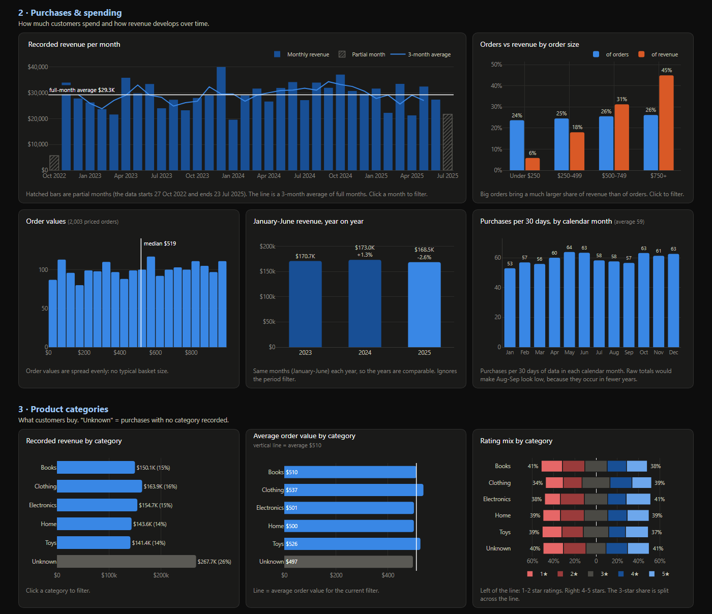

### Power BI report (`Customer_Dashboard.pbix`)
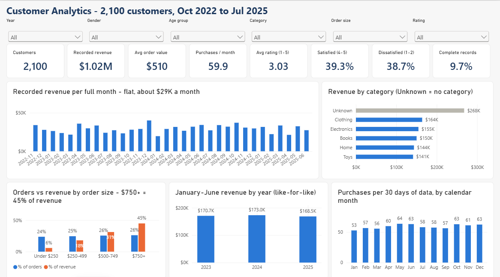
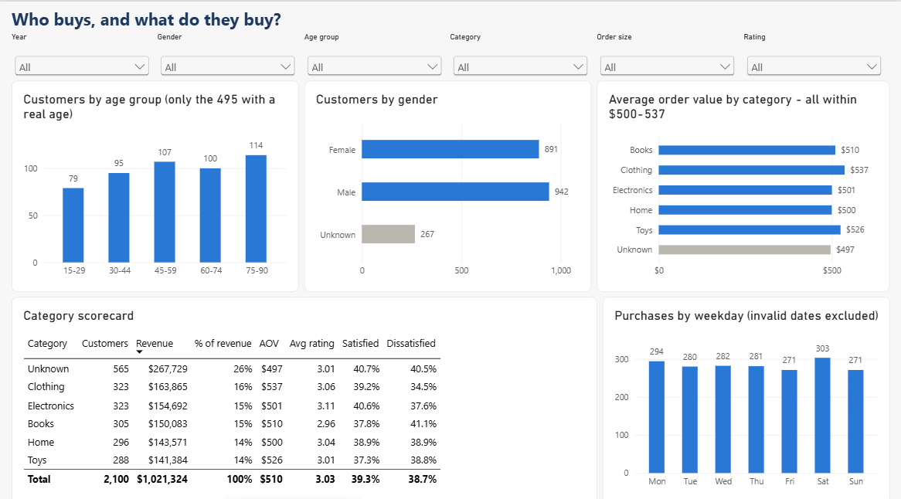
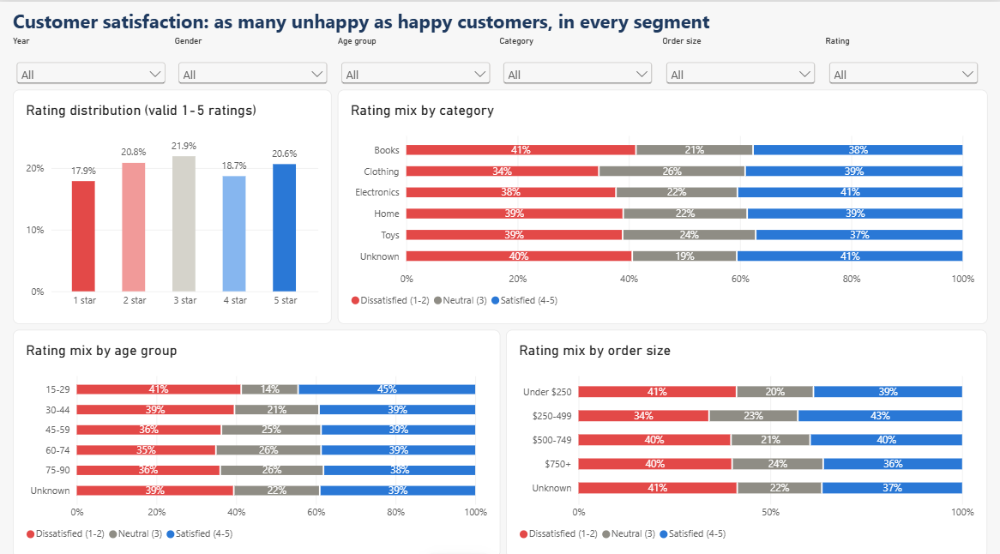
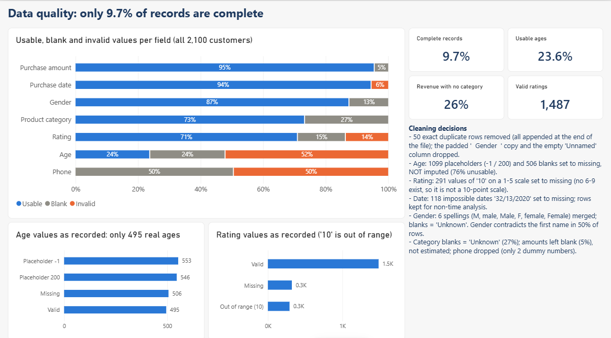
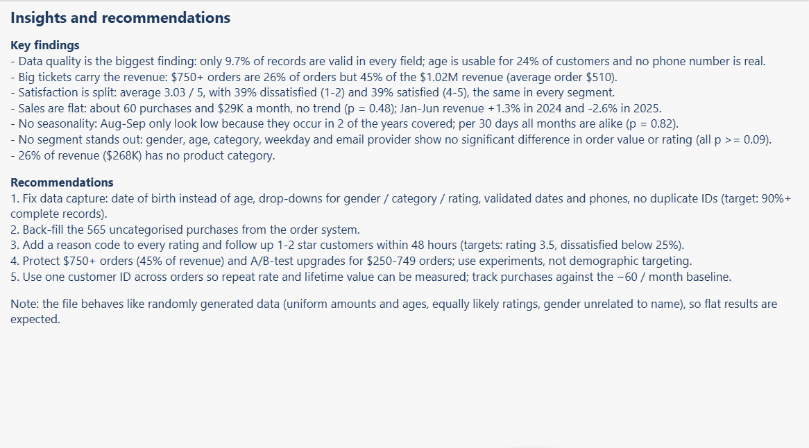

## Re-run

```bash
python clean_data.py && python analysis.py && python make_charts.py && python build_dashboard.py
python build_powerbi.py && python export_screenshots.py && python build_report.py && python package_submission.py
```
Requires pandas, scipy, matplotlib, plotly, reportlab and playwright (for the screenshots).
